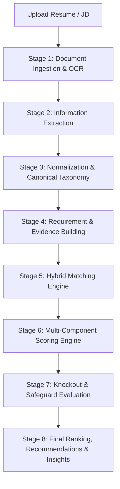

# AI Resume Screener: End-to-End Architecture, Matching Engine & Routing Specification

---

## 1. System Overview

**AI Resume Screener** is an enterprise-grade automated recruitment screening platform designed to evaluate candidate resumes against Job Descriptions (JDs) with **zero hallucination**, **deterministic precision**, and **intelligent semantic comprehension**.

The platform uses a **Belt-and-Suspenders Hybrid Architecture**:
* **Deterministic Rules & Canonical Taxonomy** are used for hard, factual criteria (Skills, Degrees, Years of Experience, Certifications, Languages, Mandatory Knockouts).
* **High-Speed LLM Inference (Groq / Cerebras)** is strictly isolated to complex semantic reasoning (Roles, Responsibilities, and Project Relevance).

```
                      ┌────────────────────────────────────────┐
                      │        Candidate Resumes & JDs         │
                      └───────────────────┬────────────────────┘
                                          │
                        [Stage 1-3: Ingest, Extract, Normalize]
                                          │
                                          ▼
                      ┌────────────────────────────────────────┐
                      │       Canonical Normalized Data        │
                      └───────────────────┬────────────────────┘
                                          │
                         [Stage 4-5: Requirement & Evidence]
                                          │
                                          ▼
                      ┌────────────────────────────────────────┐
                      │         HYBRID MATCHING ENGINE         │
                      │                                        │
                      │  Skills / Education / Experience       │
                      │  ──> 100% Deterministic (NO AI)        │
                      │                                        │
                      │  Responsibilities / Complex Roles      │
                      │  ──> Evaluated via Groq/Cerebras LLM   │
                      └───────────────────┬────────────────────┘
                                          │
                         [Stage 6-8: Scoring & Safeguards]
                                          │
                                          ▼
                      ┌────────────────────────────────────────┐
                      │    Ranked Candidates & Recruiter UI    │
                      │       (PROCEED / HOLD / REJECT)        │
                      └────────────────────────────────────────┘
```

---

## 2. End-to-End Execution Flow

The complete processing pipeline operates across **8 sequential stages**:



### Stage 1: Document Ingestion & Storage
1. Recruiter creates a **Project** and uploads a **Job Description (JD)** alongside a batch of candidate resumes (PDF, DOCX, TXT).
2. Files are validated, hashed for deduplication, and stored securely in local/cloud storage.
3. If text cannot be extracted natively (e.g., scanned PDF), OCR (Tesseract / PyMuPDF) extracts raw textual layers.

### Stage 2: Information Extraction
1. Resumes and JDs are processed via extraction services (Affinda API / Local heuristic extraction / AI extraction fallback).
2. Extracts structured sections:
   * Candidate personal details (Name, Contact, Links).
   * Skills listed across all sections.
   * Work experience history (Designation, Company, Start/End dates, Responsibilities, Achievements).
   * Education (Degree, Major, Institution, Graduation Year).
   * Projects (Project Name, Role, Description, Technologies used).
   * Certifications & Spoken Languages.

### Stage 3: Data Normalization & Canonical Taxonomy
1. Raw strings are harmonized using centralized canonical dictionaries:
   * **Skill Aliases**: Maps `"py"`, `"python3"` $\rightarrow$ `"Python"`; `"k8s"` $\rightarrow$ `"Kubernetes"`; `"postgres"` $\rightarrow$ `"PostgreSQL"`.
   * **Category Taxonomies**: Resolves categories like `RELATIONAL_DATABASE`, `CLOUD_PLATFORMS`, `PROGRAMMING_LANGUAGE`.
   * **Degree Aliases**: Maps `"B.Tech"`, `"Bachelor of Science"`, `"B.E."` $\rightarrow$ Canonical Bachelor's level.
   * **Controlled Concept Equivalences**: Maps synonymous technical standards (e.g., `"rest api"` $\leftrightarrow$ `"restful api"` $\leftrightarrow$ `"backend api"`).
2. Computes total work experience duration, accounting for overlapping employment date ranges.

### Stage 4: Requirement & Evidence Building
1. **RequirementBuilder**:
   * Analyzes the normalized JD and Recruiter configuration.
   * Splits JD requirements into discrete typed entities:
     * `SKILL` / `REQUIRED_SKILL` / `PREFERRED_SKILL`
     * `RESPONSIBILITY`
     * `EXPERIENCE` / `CONTEXTUAL_EXPERIENCE`
     * `DEGREE`
     * `CERTIFICATION`
     * `LANGUAGE`
     * `PROJECT_RELEVANCE`
     * `CANDIDATE_ATTRIBUTE` (Soft attributes / behavioral notes)
   * Assigns importance levels: `critical`, `important`, or `minor`.
   * Identifies **Hard Constraints** (e.g., Recruiter Mandatory Skills).
   * Filters out boilerplate JD headers (e.g., `"Qualifications & Requirements:"`, `"Equal Opportunity Employer"`).
2. **EvidenceBuilder**:
   * Partitions candidate resume data into uniquely indexed Evidence objects:
     * `skills:1` (All extracted candidate skills).
     * `experience:1..N` (Job title, company, description, bullet points).
     * `project:1..N` (Project title, tech stack, deliverables).
     * `education:1..N` (Degree, major, institution).
     * `certification:1..N` (Certifications).
     * `languages:1` (Languages).
     * `summary:1` (Professional profile summary).

### Stage 5: Hybrid Matching Engine Execution
*(Detailed breakdown in Section 3 & 4 below)*
* Factual requirements (Skills, Degree, Experience, Certs, Languages) run through the **Deterministic Engine**.
* Unresolved Responsibilities & Project Relevance run through the **Smart LLM Evaluator**.

### Stage 6: Component Scoring Engine
Computes granular scores ($0 - 100$) across 5 distinct dimensions:
1. **Skills Score** ($\text{Weight} \approx 35\%$): Proportional match of required and preferred skills.
2. **Experience Score** ($\text{Weight} \approx 25\%$): Total years vs JD minimum + domain title relevance.
3. **Responsibilities Score** ($\text{Weight} \approx 20\%$): Coverage of core daily job functions.
4. **Education Score** ($\text{Weight} \approx 10\%$): Degree level, major alignment, and relevance.
5. **Certifications Score** ($\text{Weight} \approx 10\%$): Relevant industry credentials.

### Stage 7: Knockouts & Safeguards
1. **Knockout Filters**:
   * If a candidate lacks any **Recruiter Mandatory Skill** $\rightarrow$ Immediate status override to **REJECT** (`MISSING_MANDATORY_SKILL`).
   * Hard minimum experience or degree knockouts.
2. **Zero / Critical Skill Safeguard**:
   * If a candidate matches $0$ critical skills, overall composite score is capped/zeroed out to prevent candidates with generic experience from passing.
3. **Experience Floor Safeguard**:
   * Penalizes candidates falling severely below minimum tenure requirements.

### Stage 8: Candidate Ranking, Recommendations & Insights
1. **Composite Score** calculation:
   $$\text{Final Score} = \sum (\text{Component Score}_i \times \text{Weight}_i) + \text{Bonuses} - \text{Penalties}$$
2. **Recommendation Assignment**:
   * **PROCEED** (Score $\ge \text{Passing Threshold}$, default $\ge 70$, no knockout failures).
   * **HOLD** (Score between $50 - 69$).
   * **REJECT** (Score $< 50$ or triggered Knockout).
3. Recruiter dashboard displays full auditability: matched vs missing skills, cited evidence snippets, and sub-claim verifications.

---

## 3. How the Matching Engine Works

The **Matching Engine** employs a multi-tiered architecture that matches each requirement kind using the most appropriate, reliable technique.

```
                                  [Requirement to Match]
                                             │
             ┌───────────────────────────────┴───────────────────────────────┐
             │                                                               │
     [Requirement Kind]                                              [Requirement Kind]
    SKILL / DEGREE / EXP                                           RESPONSIBILITY / PROJECT
             │                                                               │
             ▼                                                               ▼
┌───────────────────────────┐                                   ┌───────────────────────────┐
│   Deterministic Engine    │                                   │   Deterministic Match?    │
│  - Exact Match            │                                   └─────────────┬─────────────┘
│  - Canonical Aliases      │                                                 │
│  - Category Taxonomy      │                                   ┌─────────────┴─────────────┐
│  - Controlled Concepts    │                                  YES                          NO
│  - Proximity / Stemming   │                                   │                           │
└────────────┬──────────────┘                                   ▼                           ▼
             │                                              [MATCHED]              [Evidence Available?]
             ▼                                             (100% Score)                     │
     [Matched / Unmatched]                                                      ┌───────────┴───────────┐
     (Strict Lexical/Cosine)                                                   YES                      NO
                                                                                │                       │
                                                                                ▼                       ▼
                                                                        ┌───────────────┐         [NO_MATCH]
                                                                        │  Groq / AI    │        (0 LLM Calls)
                                                                        │  Inference    │
                                                                        └───────────────┘
```

### 3.1 Deterministic Matching Strategies
Applied across all factual criteria:
1. **Exact Matching**: Case-insensitive and whitespace-normalized string comparison.
2. **Canonical Alias Resolution**: Resolves variations to a single canonical standard (e.g., `"NodeJS"`, `"Node.js"`, `"Node"` $\rightarrow$ `"Node.js"`).
3. **Category Membership**: If JD asks for `"Relational Database"`, the engine matches if candidate has `"PostgreSQL"`, `"MySQL"`, or `"Oracle"`.
4. **Controlled Concept Equivalence**: Recognizes synonyms like `"RESTful APIs"` $\leftrightarrow$ `"Backend Web Services"`.
5. **Technical Stemming & Suffix Stripping**: Handles irregular verbs and suffixes (`"developed"` $\rightarrow$ `"develop"`, `"building"` $\rightarrow$ `"build"`).
6. **Multi-Word Proximity Search**: Identifies multi-token concepts appearing together in candidate project/experience blocks.

### 3.2 Responsibility Matching: Semantic Action & Decomposition
For job duties (e.g., *"Architect and deploy scalable REST APIs using FastAPI and Docker"*), the engine:
1. Decomposes the sentence into:
   * **Action Verbs**: `architect`, `deploy`
   * **Technologies**: `FastAPI`, `Docker`, `REST APIs`
   * **Deliverables**: `scalable backend systems`
2. Checks candidate experience and project logs for exact or synonymous actions.
3. If unresolved deterministically, it gathers relevant candidate experience blocks and routes to the LLM.

### 3.3 Strict Entity-Type Compatibility Rules
To prevent cross-domain false positives (e.g., citing a project description to satisfy an education degree requirement):
* `DEGREE` $\rightarrow$ Allowed evidence: `{"education"}`
* `EXPERIENCE` $\rightarrow$ Allowed evidence: `{"experience"}`
* `SKILL` $\rightarrow$ Allowed evidence: `{"skills", "experience", "project", "summary", "certification"}`
* `RESPONSIBILITY` $\rightarrow$ Allowed evidence: `{"experience", "project", "summary", "skills"}`
* `CERTIFICATION` $\rightarrow$ Allowed evidence: `{"certification"}`
* `LANGUAGE` $\rightarrow$ Allowed evidence: `{"languages"}`

If an LLM or heuristic cites an incompatible evidence ID, the evidence is **automatically rejected** (`cross_entity_evidence_forbidden`).

### 3.4 Multi-Provider LLM Infrastructure (Groq & Cerebras)
* **Primary LLM**: **Groq** (`llama-3.3-70b-versatile` or `openai/gpt-oss-20b` via OpenAI-compatible endpoint).
  * Backed by an intelligent **API Key Pool** (auto-rotates on rate limits).
  * **Token Budget Gate (TPM/RPM Tracker)**: Tracks token reservations in real-time.
* **Secondary Fallback LLM**: **Cerebras** (`gpt-oss-120b`).
  * If Groq returns `429`, timeout, `5xx`, or runs out of TPM budget, requests immediately failover to Cerebras with zero downtime.
* **Circuit Breaker**: Tracks provider failure rates to fast-fail dead providers and auto-recover.
* **LRU Caching**: Identical evaluation requests are cached by SHA256 digest to save latency and token costs.
* **Truncation Sub-batch Recovery**: If an LLM response cuts off due to max tokens, missing requirements are isolated and re-evaluated in a focused sub-batch.

### 3.5 Hallucination Prevention & Guardrails
1. **Mandatory Evidence Citation**: Every LLM match verdict must cite valid, existing candidate `evidence_id`s. Unbacked verdicts are downgraded to `UNRESOLVED` or `NO_MATCH`.
2. **Negation & Contradiction Detection**: If the LLM reasoning text contains phrases like *"Candidate has no experience with X"* or *"No candidate evidence"*, the status is forced to `NO_MATCH` with a coverage score of `0.0`, overriding any erroneous positive score.
3. **Confidence Threshold Filter**: Verdicts with confidence below `HYBRID_MATCHING_LLM_CONFIDENCE_THRESHOLD` (default $0.70$) are rejected to `NO_MATCH`.

---

## 4. Do Failed Skills Go to the LLM or Not?

### 🔴 Core Answer: **NO. Failed Skills DO NOT go to the LLM.**

In the AI Resume Screener architecture, **Required Skills, Preferred Skills, and Mandatory Skills are 100% Deterministic and are NEVER sent to the LLM**.

```
                           [Skill Requirement]
                                    │
                                    ▼
                     ┌─────────────────────────────┐
                     │ Step 1: Canonical / Alias   │
                     │         Exact Match         │
                     └──────────────┬──────────────┘
                                    │
                         ┌──────────┴──────────┐
                        YES                    NO
                         │                     │
                         ▼                     ▼
                   [MATCHED: 1.0]     ┌─────────────────────────────┐
                   (0 LLM Calls)      │ Step 2: Evidence Prefilter  │
                                      │  (Lexical / Cosine / SBERT) │
                                      └──────────────┬──────────────┘
                                                     │
                                          ┌──────────┴──────────┐
                                         YES                    NO
                                          │                     │
                                          ▼                     ▼
                               ┌──────────────────────┐   [NO_MATCH: 0.0]
                               │ Step 3: Math Scoring │   (0 LLM Calls)
                               │  Score >= 0.65 -> 1.0│   (LLM NOT ATTEMPTED)
                               │  Score >= 0.15 -> 0.5│
                               │  Score <  0.15 -> 0.0│
                               └──────────────────────┘
                                    (0 LLM Calls)
```

### 4.1 The 4-Step Skill Evaluation Lifecycle

When evaluating any skill requirement:

1. **Step 1: Canonical & Alias Matching (No LLM)**
   * Checks for exact match, skill aliases, category dictionaries, and controlled concept equivalences across candidate skills and resume text.
   * If matched $\rightarrow$ Status: `MATCHED`, Coverage: `1.0`. **Stops here.**

2. **Step 2: Unmatched Evidence Prefiltering (No LLM)**
   * If the skill is not found in Step 1, the engine searches project descriptions and experience text using:
     * Lexical token overlap.
     * Cosine keyword similarity.
     * Semantic embedding similarity.
   * If no candidate evidence meets the threshold $\rightarrow$ Status: `NO_MATCH`, Coverage: `0.0`. **Stops here (0 LLM Calls).**

3. **Step 3: Deterministic Partial-Match Mathematical Scoring (No LLM)**
   * If candidate evidence text has relevant overlap:
     * Effective score $\ge 0.65 \rightarrow$ Status: `MATCHED`, Coverage: `1.0`.
     * Effective score between $0.15$ and $0.64 \rightarrow$ Status: `PARTIALLY_MATCHED`, Coverage: `0.35 - 0.65`.
     * Effective score $< 0.15 \rightarrow$ Status: `NO_MATCH`, Coverage: `0.0`.
   * **Stops here (0 LLM Calls).**

4. **Step 4: Truly Unmatched Skills (No LLM)**
   * If candidate has no matching evidence $\rightarrow$ Status: `NO_MATCH`, Coverage: `0.0`, Evidence IDs: `[]`.
   * Telemetry logs: `fallback_eligible=False`, `llm_attempted=False`, `reason="No candidate evidence available for required skill"`.

### 4.2 Why Skills Are Excluded From LLM Routing

| Reason | Explanation |
| :--- | :--- |
| **Zero Hallucination Guarantee** | LLMs tend to assume or hallucinate that a candidate knows a skill based on adjacent context (e.g., assuming a Python developer knows Django even if unmentioned). Deterministic rules prevent this. |
| **Auditability & Compliance** | Recruiters and hiring managers must be able to trace exactly why a skill was marked as matched or missing. |
| **Speed & Throughput** | Evaluating 20 skills per resume across 500 candidates via LLM would require 10,000 LLM calls. Deterministic matching runs in **< 5 milliseconds**. |
| **Cost & Token Conservation** | Eliminates unnecessary API token consumption, reserving LLM quotas strictly for complex responsibilities. |

---

## 5. What Actually Goes to the LLM?

Only requirements that require **human-level contextual and narrative interpretation** are routed to the LLM:

| Requirement Type | Routing Destination | Justification |
| :--- | :---: | :--- |
| **Skills (Required / Preferred / Mandatory)** | 🛑 **100% Deterministic (NO AI)** | Factual keyword, alias, and taxonomy matching. |
| **Degrees & Education** | 🛑 **100% Deterministic (NO AI)** | Degree levels and majors are strictly defined. |
| **Years of Experience** | 🛑 **100% Deterministic (NO AI)** | Calculated mathematically from timeline dates. |
| **Certifications & Languages** | 🛑 **100% Deterministic (NO AI)** | Factual registry & certification name lookup. |
| **Roles & Responsibilities** | 🤖 **Groq AI (Fallback Cerebras)** | Complex multi-sentence job duties requiring semantic understanding of candidate project achievements. |
| **Project Relevance** | 🤖 **Groq AI (Fallback Cerebras)** | Evaluating whether candidate projects align with domain problem statements. |

> **Note on Responsibility Routing:** Even for Responsibilities, if the candidate's resume has **zero experiential evidence** (empty project/experience text), the engine immediately assigns `NO_MATCH` without making an LLM call.

---

## 6. Summary Comparison Table

| Feature | Skills Evaluation | Responsibility Evaluation |
| :--- | :--- | :--- |
| **Primary Method** | Canonical Alias & Taxonomy Match | Semantic Action Match + LLM Evaluation |
| **Fallback on Failure** | Mathematical Evidence Prefilter (Lexical/Cosine) | Groq LLM (Failover: Cerebras) |
| **Can Trigger LLM?** | ❌ **NO (Never)** | ✅ **YES (If experiential evidence exists)** |
| **Coverage Scoring** | Exact (1.0), Partial (0.35-0.65), None (0.0) | Direct (1.0), Adjacent (0.5), None (0.0) |
| **Knockout Capability** | ✅ Yes (Mandatory Skills can Knockout REJECT) | ❌ No (Contributes to overall category score) |
| **Hallucination Risk** | **0% (Pure Code Logic)** | Guarded by Evidence Citation & Negation Detection |
