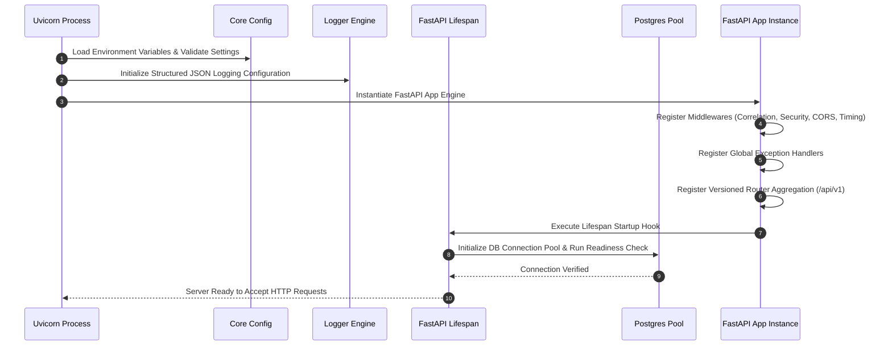

# Enterprise Backend Architecture Specification
**Project**: `ai-resume-screener`  
**Target Stack**: Python 3.12, FastAPI, SQLAlchemy 2.0 (Async), Alembic, PostgreSQL, Pydantic v2, Docker  
**Role**: Principal Software Architect  
**Status**: Approved Foundation Specification  

---

## 1. Backend Folder Structure

The backend follows a **Pipeline-Oriented Layered Architecture** optimized for FastAPI, Pydantic v2, and SQLAlchemy 2.0. Rather than dividing code by domain modules, a pipeline-oriented layered structure separates data access, business orchestration, transport, and infrastructure concerns into explicit functional layers. This design ensures clean maintainability, clear dependency direction, and scalable pipeline development across all future stages.

```text
backend/
├── app/
│   ├── api/                      # Delivery & Transport Layer (HTTP Routes, Versioning)
│   │   ├── deps.py               # Central Dependency Injection declarations
│   │   ├── router.py             # Root Router Aggregator (includes v1, future v2)
│   │   └── v1/                   # Version 1 API Namespace
│   │       ├── endpoints/        # Stage/Resource specific endpoint routers
│   │       │   ├── health.py     # System health & readiness probes
│   │       │   └── .gitkeep
│   │       └── router.py         # Version 1 Router Aggregator
│   │
│   ├── core/                     # Infrastructure & Core Configuration
│   │   ├── config.py             # Typed Pydantic Settings & Environment Loading
│   │   ├── constants.py          # App-wide constants, error codes, and enums
│   │   ├── exceptions.py         # Custom Application Exception Hierarchy
│   │   ├── logging.py            # Structured JSON Logging Engine
│   │   └── security.py           # Cryptographic primitives & JWT token handling
│   │
│   ├── db/                       # Database Infrastructure Assets
│   │   ├── base.py               # Declarative Base & Metadata Naming Registry
│   │   ├── mixins.py             # Reusable Model Mixins (UUID, Timestamps)
│   │   └── session.py            # Async Engine & Session context handlers
│   │
│   ├── middlewares/              # Application Request/Response Pipeline
│   │   ├── correlation.py        # Correlation ID trace middleware
│   │   ├── error_handler.py      # Global unhandled exception handler
│   │   ├── logging.py            # Request/Response metrics & timing logger
│   │   └── security_headers.py   # Enterprise OWASP security response headers
│   │
│   ├── models/                   # SQLAlchemy 2.0 ORM Entity Definitions
│   │   └── .gitkeep              # Database table models (User, Resume, Job, Score)
│   │
│   ├── repositories/             # Data Access Layer (DAL / Async Query Abstraction)
│   │   └── .gitkeep              # Encapsulates raw DB interactions behind repository methods
│   │
│   ├── schemas/                  # Pydantic v2 Data Transfer Objects (DTOs)
│   │   ├── base.py               # Base Pydantic models with generic ORM configs
│   │   ├── error.py              # Standardized API Error Response Schemas
│   │   └── health.py             # Health check payload structures
│   │
│   ├── services/                 # Business Logic & Pipeline Execution Layer
│   │   └── .gitkeep              # Orchestrates pipeline stages (Parsing, LLM Scoring, etc.)
│   │
│   ├── utils/                    # Shared Generic Helper Utilities & Functions
│   │   └── .gitkeep              # Standalone utility functions (formatting, parsing helpers)
│   │
│   └── main.py                   # ASGI Application Factory & Lifespan Entrypoint
│
├── tests/                        # Test Suite Root
│   ├── unit/                     # Fast isolated unit tests (schemas, utilities)
│   ├── integration/              # Database and middleware integration tests
│   ├── e2e/                      # Full API pipeline tests
│   ├── fixtures/                 # Shared pytest fixtures and mock objects
│   └── conftest.py               # Root pytest configuration & async setup
│
├── .env.example                  # Environment configuration template
├── alembic.ini                   # Database migration tool configuration
└── requirements.txt              # Production python dependency definitions
```

### Layer Responsibilities Summary
* **`app/api/`**: **HTTP Transport Layer**. Manages route registration, API versioning namespaces (`v1`), endpoint controllers, and dependency injection wiring.
* **`app/core/`**: **System Infrastructure Layer**. Manages app settings, structured logging, custom exception hierarchies, security primitives, and global system constants.
* **`app/db/`**: **Database Engine Infrastructure**. Manages connection pooling, async session scoping, SQLAlchemy Base metadata, and migration configurations.
* **`app/middlewares/`**: **ASGI Pipeline Layer**. Executes cross-cutting request/response operations (Trace Correlation IDs, Security Headers, CORS, Response Timing).
* **`app/models/`**: **ORM Entity Layer**. Defines SQLAlchemy 2.0 declarative database models and table relationships.
* **`app/repositories/`**: **Data Access Layer (DAL)**. Hides database query logic behind async repository interfaces, isolating SQL/ORM queries from business logic.
* **`app/schemas/`**: **Data Transfer Layer (DTO)**. Defines strict Pydantic v2 schemas for API request validation and response serialization.
* **`app/services/`**: **Business & Pipeline Logic Layer**. Implements core domain processing, resume ingestion workflows, AI scoring algorithms, and pipeline execution.
* **`app/utils/`**: **Shared Utility Layer**. Contains stateless helper functions, date/time formatting utilities, and generic text manipulators.
* **`app/main.py`**: **Application Lifecycle Entrypoint**. Instantiates the FastAPI engine, binds middlewares, registers handlers, and manages startup/shutdown lifespan events.

---

## 2. Configuration & Core Infrastructure Layer (`app/core/`)

The `app/core/` package provides application settings, infrastructure adapters, security primitives, custom exceptions, and system-wide constants.

```text
app/core/
├── config.py             # Strongly-typed Pydantic settings & environment configuration
├── constants.py          # Application-wide constants, error codes, and enums
├── exceptions.py         # Custom application exception hierarchy
├── logging.py            # Structured JSON logging engine and formatter setups
└── security.py           # Cryptographic primitives, hashing, and JWT token handling
```

### File Responsibilities Summary
* **`core/config.py`**: Manages environment variables using `pydantic-settings` (`BaseSettings`). Validates database URIs, environment modes (`AppEnv`), server host/ports, and security keys. Loaded via `@functools.lru_cache()` for immutability and performance.
* **`core/constants.py`**: Centralizes fixed system constants, processing state enums (e.g., `JobStatus`, `ScoreStatus`), error code strings, and static application defaults.
* **`core/exceptions.py`**: Defines custom exception hierarchy (`AppException`, `NotFoundException`, `UnauthorizedException`, `ValidationException`, `ConflictException`) to enforce uniform error handling across services.
* **`core/logging.py`**: Configures structured JSON logging for production and colorized output for development. Integrates trace correlation IDs into every log context.
* **`core/security.py`**: Houses password hashing abstractions (Bcrypt / Passlib), cryptographic utilities, JWT access token creation, and signature verification logic.

---

## 3. Database Layer (`app/db/`)

The database layer manages database connections, session lifecycles, metadata registries, and common model mixins using SQLAlchemy 2.0 Async Engine and `asyncpg`.

```text
app/db/
├── base.py               # Declarative Base & metadata constraint naming registry
├── mixins.py             # Reusable ORM model mixins (UUID primary keys, Timestamps)
└── session.py            # Async Engine instantiation, sessionmaker, and get_db generator
```

### Architectural Breakdown
1. **SQLAlchemy Base (`db/base.py`)**:
   Defines the central `DeclarativeBase` associated with an explicit PostgreSQL naming convention (`ix_`, `uq_`, `ck_`, `fk_`, `pk_`) to ensure deterministic index and constraint naming across migrations.
   ```python
   POSTGRES_NAMING_CONVENTION = {
       "ix": "ix_%(column_0_label)s",
       "uq": "uq_%(table_name)s_%(column_0_name)s",
       "ck": "ck_%(table_name)s_%(constraint_name)s",
       "fk": "fk_%(table_name)s_%(column_0_name)s_%(referred_table_name)s",
       "pk": "pk_%(table_name)s"
   }
   ```

2. **Common Mixins (`db/mixins.py`)**:
   Provides reusable model column abstractions to eliminate code duplication across ORM models:
   * **`UUIDMixin`**: Primary key mapping (`id`) using PostgreSQL native `UUIDv4`.
   * **`TimestampMixin`**: Audit fields (`created_at`, `updated_at`) with automatic UTC server timestamps.

3. **Async Session Lifecycle (`db/session.py`)**:
   Manages `create_async_engine` connection pooling (`pool_size`, `max_overflow`, `pool_pre_ping`) and exposes `AsyncSessionLocal`. Provides the async generator `get_db()` dependency:
   ```python
   async def get_db() -> AsyncGenerator[AsyncSession, None]:
       async with AsyncSessionLocal() as session:
           try:
               yield session
           except Exception:
               await session.rollback()
               raise
           finally:
               await session.close()
   ```

4. **Alembic Integration**:
   Alembic migration runner (`alembic/env.py`) imports `Base` from `app.db.base` and imports all models from `app.models` to enable auto-generation (`alembic revision --autogenerate`) of SQL schema diffs.

---

## 4. API Layer Organization (`app/api/`)

The API layer handles HTTP request delivery, routing namespaces, versioning, and dependency injection.

```text
app/api/
├── deps.py               # Centralized FastAPI Dependency Injection providers
├── router.py             # Top-level Root Router Aggregator
└── v1/                   # Version 1 API Namespace
    ├── endpoints/        # Stage and Resource specific endpoints
    │   ├── health.py     # System Liveness & Database Readiness probes
    │   └── .gitkeep
    └── router.py         # Version 1 Router Aggregator
```

### Architectural Key Concepts
* **Router Aggregation**:
  - `api/router.py` acts as the root router mounted directly to the FastAPI app instance, organizing top-level API namespaces (`/api/v1`, future `/api/v2`).
  - `api/v1/router.py` aggregates sub-routers from individual resource endpoints in `api/v1/endpoints/`.
* **API Versioning**:
  - Employs URI-based versioning (`/api/v1`). Allows introducing new API versions in parallel without breaking backwards compatibility for existing client applications.
* **Dependency Injection (`api/deps.py`)**:
  - Centralizes reusable FastAPI `Depends` providers: database sessions (`get_db`), configuration settings (`get_settings`), repository instances, and authentication context placeholders (`get_current_user`).
* **Future Endpoint Scalability**:
  - Future stage endpoints (e.g., `auth.py`, `resumes.py`, `jobs.py`, `scoring.py`) are added as isolated router files inside `api/v1/endpoints/` and included into `api/v1/router.py` with zero changes required to root infrastructure or middleware logic.

---

## 5. Exception Handling Strategy

All error responses across the application conform to a unified JSON contract. Custom domain exceptions subclass a foundational `AppException`.

### Error Payload Specification (`app/schemas/error.py`)
```json
{
  "error": {
    "code": "ENTITY_NOT_FOUND",
    "message": "The requested resource was not found.",
    "details": {},
    "timestamp": "2026-08-06T11:24:00Z",
    "correlation_id": "c3094775-6804-4861-a0c3-04870f2095f9"
  }
}
```

### Exception Hierarchy (`app/core/exceptions.py`)
```text
AppException (Base Class: status_code, error_code, message, details)
├── NotFoundException (404)
├── UnauthorizedException (401)
├── ForbiddenException (403)
├── ValidationException (422)
├── ConflictException (409)
└── InternalServerException (500)
```

### Global Handlers Registered at App Level
1. **`AppException` Handler**: Transforms custom domain exceptions into standard error payloads.
2. **`RequestValidationError` Handler**: Catches Pydantic v2 validation errors and transforms deep field errors into clear `ValidationException` formats.
3. **`Exception` Handler (Fallback)**: Catches unhandled runtime exceptions, logs stack trace with `correlation_id`, and returns generic 500 error without exposing stack trace details to clients.

---

## 6. Middleware Architecture

Request handling flows through a pipeline of low-overhead ASGI middlewares:

```text
Request ──► [Correlation ID] ──► [Security Headers] ──► [CORS] ──► [Request Timing & Logging] ──► Router
                                                                                                    │
Response ◄── [GZip Compress] ◄── [Response Headers] ◄───────────────────────────────────────────────┘
```

1. **`RequestCorrelationIdMiddleware`**: Inspects `X-Correlation-ID` request header or generates a new UUIDv4. Injects correlation ID into request state and logging context.
2. **`CORSMiddleware`**: Configures allowed origins, credentials, methods, and headers based on `APP_ENV`.
3. **`SecurityHeadersMiddleware`**: Injects production security headers (`X-Content-Type-Options: nosniff`, `X-Frame-Options: DENY`, `Strict-Transport-Security`).
4. **`RequestTimingLoggingMiddleware`**: Measures execution latency, adds `X-Process-Time` response header, and emits structured log entry upon completion.
5. **`GZipMiddleware`**: Compresses HTTP responses exceeding 1000 bytes.

---

## 7. Dependency Injection Engine

FastAPI's `Depends` system provides clean, decoupled component wiring across request lifecycles.

### Standard Dependency Suite (`app/api/deps.py`)
```python
# 1. Configuration Dependency
# get_config_dep() -> Returns cached Settings instance.

# 2. Database Session Dependency
# get_db_dep() -> Yields scoped AsyncSession for the request lifecycle.

# 3. Authentication Interface Placeholder (Prepared for Stage 1)
# async def get_current_user_placeholder() -> None:
#     """Placeholder dependency for JWT validation and user context extraction."""
#     pass
```

---

## 8. Logging Architecture

The backend implements structured JSON logging to enable seamless log ingestion into enterprise aggregators (Datadog, ElasticSearch/ELK, CloudWatch).

### Key Requirements
* **Format**: JSON in non-development environments; colorized human-readable text in `development`.
* **Contextual Correlation**: Every log record automatically includes `correlation_id`, `environment`, `app_name`, `module`, and `timestamp`.
* **Zero Secrets Leakage**: Automatic scrubbing of authorization headers, DB passwords, and sensitive fields.

### JSON Log Output Structure
```json
{
  "timestamp": "2026-08-06T11:24:49Z",
  "level": "INFO",
  "environment": "production",
  "correlation_id": "8f0a23bc-11b3-461d-9e66-6b21bc089df2",
  "logger": "app.api.v1.health",
  "message": "Database readiness probe successful",
  "duration_ms": 4.12
}
```

---

## 9. Testing Strategy

The backend uses **`pytest`** configured for asynchronous test execution via `pytest-asyncio`.

### Directory Layout & Test Boundaries
* **`tests/unit/`**: Pure functions, Pydantic schema validations, utility classes. Executed without database connections.
* **`tests/integration/`**: Database queries, Alembic migration verification, custom middleware execution.
* **`tests/e2e/`**: Full HTTP lifecycle validation using `httpx.AsyncClient` against API endpoints.

### Pytest Fixture Lifecycle (`tests/conftest.py`)
1. **`event_loop`**: Session-scoped asyncio loop.
2. **`async_client`**: Function-scoped `httpx.AsyncClient` bound to ASGI app instance.
3. **`db_session`**: Transactional database session wrapper that auto-rolls back changes after each test run to ensure strict isolation.

---

## 10. Coding Standards & Conventions

### Naming Conventions
* **Directories & Files**: `snake_case` (e.g., `health_check.py`, `security_headers.py`).
* **Classes & Models**: `PascalCase` (e.g., `AppException`, `TimestampMixin`, `Settings`).
* **Functions & Variables**: `snake_case` (e.g., `get_db()`, `ASYNC_DATABASE_URI`).
* **Constants**: `SCREAMING_SNAKE_CASE` (e.g., `POSTGRES_NAMING_CONVENTION`).

### Import Rules & Ordering (Strictly Enforced via Ruff / Isort)
1. Standard library imports.
2. Third-party library imports (`fastapi`, `pydantic`, `sqlalchemy`).
3. Local application imports (`app.core`, `app.db`, `app.api`).

### Type Safety & Documentation
* **Type Hints**: 100% type hint coverage required on all function signatures and return types.
* **Docstrings**: Google-style docstrings for public classes, complex helper utilities, and custom middlewares.

---

## 11. Application Startup Lifecycle Flow

When `uvicorn app.main:app` is executed, the backend initializes in the following deterministic order:



---

## 12. Development & Branching Workflow

For team collaboration across parallel frontend and backend implementations:

### Branch Model
```text
main (Protected)
 └── develop (Integration)
      ├── feature/backend-stage-1
      └── feature/frontend-stage-1
```

### Protocol for Stage Implementation
1. **Branch Creation**: Developers checkout feature branches from `develop` (`git checkout -b feature/backend-stage-1 develop`).
2. **Independent Progress**: Backend developer works strictly within `backend/app/` layered packages (`services/`, `repositories/`, `models/`, `schemas/`) and test directories. Frontend developer works within `frontend/src/`.
3. **Pull Request Rules**:
   - PR targets `develop`.
   - Continuous Integration (CI) checks must pass (Linting, Pytest suite execution).
   - Require 1 approval review.
   - Merges perform a **Squash and Merge** to maintain a clean linear history on `develop`.
