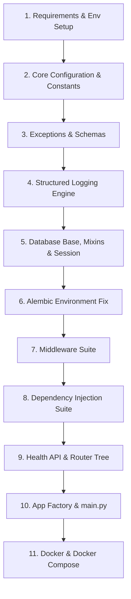

# Backend Foundation Implementation Specification

**Project**: `ai-resume-screener`  
**Target Execution Agent**: Codex / Backend Implementation Engineers  
**Target Stack**: Python 3.12, FastAPI, SQLAlchemy 2.0 (Async), Alembic, PostgreSQL, Pydantic v2, Docker  
**Status**: Approved Specification for Execution  

---

## 1. Architectural Adjustments & Implementation Scope

This specification provides the exact blueprint for initializing the **backend foundation** of `ai-resume-screener`. 

### Required Structural Corrections
1. **Relocate `main.py`**: Delete `backend/main.py` and create `backend/app/main.py` as the sole ASGI application entrypoint.
2. **Fix Alembic Script Location**: Update `backend/alembic.ini` configuration setting `script_location = alembic` to reference the actual script folder at `backend/alembic/`.
3. **Configure Alembic Metadata Binding**: Wire `alembic/env.py` to import `Base` from `app.db.base` and set `target_metadata = Base.metadata`.
4. **Ensure Uvicorn Import Compatibility**: Structure package imports so the application starts cleanly from the `backend/` directory using:
   ```bash
   uvicorn app.main:app --reload
   ```

### Scope Exclusions (Strictly Enforced)
* **DO NOT** create business logic or stage modules.
* **DO NOT** create authentication routes, JWT logic, or user models.
* **DO NOT** create candidate models, resume upload endpoints, or file parsers.
* **DO NOT** create recruiter endpoints, job posting models, or AI scoring services.

---

## 2. File Inventory

### Files to Modify
* `backend/alembic.ini`: Update `script_location` to `alembic`.
* `backend/alembic/env.py`: Wire async engine execution, config loading, and `target_metadata`.
* `backend/requirements.txt`: Pin exact production and testing python dependencies.
* `backend/.env.example`: Provide complete backend environment variables template.
* `docker-compose.yml`: Add PostgreSQL database and backend service specifications.

### Files to Delete
* `backend/main.py`: Remove misplaced root file.

### Files to Create
```text
backend/
├── app/
│   ├── api/
│   │   ├── deps.py               # Dependency Injection providers
│   │   ├── router.py             # Root Router Aggregator
│   │   └── v1/
│   │       ├── endpoints/
│   │       │   └── health.py     # System Liveness & Readiness endpoints
│   │       └── router.py         # Version 1 Router Aggregator
│   │
│   ├── core/
│   │   ├── config.py             # Pydantic BaseSettings & Environment loader
│   │   ├── constants.py          # App constants, enums, error codes
│   │   ├── exceptions.py         # Custom AppException hierarchy
│   │   ├── logging.py            # Structured JSON logger setup
│   │   └── security.py           # Security & hashing placeholders
│   │
│   ├── db/
│   │   ├── base.py               # DeclarativeBase & metadata naming conventions
│   │   ├── mixins.py             # UUIDMixin & TimestampMixin
│   │   └── session.py            # Async engine, sessionmaker, get_db generator
│   │
│   ├── middlewares/
│   │   ├── correlation.py        # X-Correlation-ID trace middleware
│   │   ├── error_handler.py      # Global unhandled exception handler
│   │   ├── logging.py            # Request/Response metrics & timing logger
│   │   └── security_headers.py   # OWASP security headers middleware
│   │
│   ├── schemas/
│   │   ├── base.py               # Shared Pydantic base model settings
│   │   ├── error.py              # Standardized API Error response DTO
│   │   └── health.py             # Liveness & Readiness response DTOs
│   │
│   └── main.py                   # FastAPI Application Factory & Lifespan Hook
│
├── docker/
│   └── Dockerfile                # Multi-stage Python 3.12 container build script
```

---

## 3. Step-by-Step Implementation Order

Codex must implement the components in the following chronological order to satisfy internal dependency hierarchies:



---

### Step 1: Dependencies & Environment (`requirements.txt`, `.env.example`)
* **`requirements.txt`**: Pin foundational packages:
  - `fastapi>=0.110.0,<0.112.0`
  - `uvicorn[standard]>=0.28.0`
  - `pydantic>=2.6.0`
  - `pydantic-settings>=2.2.0`
  - `sqlalchemy>=2.0.28`
  - `asyncpg>=0.29.0`
  - `alembic>=1.13.1`
  - `python-dotenv>=1.0.1`
  - `structlog>=24.1.0`
  - `httpx>=0.27.0`
  - `pytest>=8.1.0`
  - `pytest-asyncio>=0.23.5`
  - `python-multipart>=0.0.9`

---

### Step 2: Core Configuration Layer (`app/core/config.py` & `constants.py`)
* **`app/core/constants.py`**:
  - Define `AppEnv` enum (`DEVELOPMENT`, `TESTING`, `STAGING`, `PRODUCTION`).
  - Define system-wide constant strings and error code enumerations (`SYSTEM_ERROR`, `VALIDATION_ERROR`, `DATABASE_ERROR`).
* **`app/core/config.py`**:
  - Create `Settings(BaseSettings)` reading `.env`.
  - Add fields: `APP_NAME`, `APP_ENV`, `DEBUG`, `API_V1_STR`, `HOST`, `PORT`, `POSTGRES_SERVER`, `POSTGRES_PORT`, `POSTGRES_USER`, `POSTGRES_PASSWORD`, `POSTGRES_DB`, `CORS_ORIGINS`.
  - Expose computed property `@property def ASYNC_DATABASE_URI(self) -> str` building `postgresql+asyncpg://...`.
  - Wrap provider in `@lru_cache()` function `get_settings()`.

---

### Step 3: Exception Hierarchy & Schemas (`app/core/exceptions.py`, `app/schemas/error.py`)
* **`app/schemas/error.py`**:
  - Define `ErrorDetail` schema (`code`, `message`, `details`, `timestamp`, `correlation_id`).
  - Define `ErrorResponsePayload` schema (`error: ErrorDetail`).
* **`app/core/exceptions.py`**:
  - Implement base `AppException(Exception)` with `status_code`, `error_code`, `message`, `details`.
  - Subclass: `NotFoundException` (404), `UnauthorizedException` (401), `ForbiddenException` (403), `ValidationException` (422), `ConflictException` (409), `InternalServerException` (500).

---

### Step 4: Structured Logging Engine (`app/core/logging.py`)
* Configure `logging.config.dictConfig` / `structlog`.
* Set log output format: JSON for non-development environments, formatted color text for `development`.
* Add custom processor to extract trace `correlation_id` from contextual contextvars.

---

### Step 5: Database Infrastructure (`app/db/base.py`, `mixins.py`, `session.py`)
* **`app/db/base.py`**:
  - Instantiate `Base(DeclarativeBase)` with constraint metadata naming dictionary:
    `{"ix": "ix_%(column_0_label)s", "uq": "uq_%(table_name)s_%(column_0_name)s", "ck": "ck_%(table_name)s_%(constraint_name)s", "fk": "fk_%(table_name)s_%(column_0_name)s_%(referred_table_name)s", "pk": "pk_%(table_name)s"}`.
* **`app/db/mixins.py`**:
  - Create `UUIDMixin` defining `id: Mapped[uuid.UUID]` with default `uuid.uuid4`.
  - Create `TimestampMixin` defining `created_at` and `updated_at` with server UTC defaults.
* **`app/db/session.py`**:
  - Create `create_async_engine(settings.ASYNC_DATABASE_URI, pool_pre_ping=True, pool_size=10, max_overflow=20)`.
  - Instantiate `AsyncSessionLocal = async_sessionmaker(bind=engine, class_=AsyncSession, expire_on_commit=False)`.
  - Create async generator `async def get_db() -> AsyncGenerator[AsyncSession, None]` with yield and rollback error handling.

---

### Step 6: Alembic Integration Fix (`alembic.ini`, `alembic/env.py`)
* **`backend/alembic.ini`**: Update line 3 to `script_location = alembic`.
* **`backend/alembic/env.py`**:
  - Import `Base` from `app.db.base` and set `target_metadata = Base.metadata`.
  - Import `get_settings` to dynamically supply `sqlalchemy.url` from `settings.ASYNC_DATABASE_URI`.
  - Configure `run_migrations_online()` to use `asyncio` loop with `create_async_engine` and `connect()`.

---

### Step 7: Middleware Pipeline (`app/middlewares/`)
* **`correlation.py`**: Intercept requests, extract `X-Correlation-ID` or generate UUIDv4, set response header and request state.
* **`security_headers.py`**: Append standard HTTP security headers (`X-Content-Type-Options`, `X-Frame-Options`, `X-XSS-Protection`).
* **`logging.py`**: Measure request processing duration in milliseconds and log structured request/response summary.
* **`error_handler.py`**: Register FastAPI exception handlers for `AppException`, `RequestValidationError`, and generic `Exception`.

---

### Step 8: Dependency Injection (`app/api/deps.py`)
* Expose `get_config_dep = Depends(get_settings)`.
* Expose `get_db_dep = Depends(get_db)`.
* Define placeholder signature `async def get_current_user_dep()` for Stage 1 authentication.

---

### Step 9: Health API & Router Registration (`app/api/v1/endpoints/health.py`, `router.py`)
* **`app/schemas/health.py`**: Define `HealthResponse` and `ReadinessResponse` schemas.
* **`app/api/v1/endpoints/health.py`**:
  - `GET /api/v1/health/liveness`: Returns `{ "status": "ok", "environment": settings.APP_ENV }`.
  - `GET /api/v1/health/readiness`: Executes `SELECT 1` query using `get_db_dep`. Returns 200 OK if successful; raises HTTP 503 if database connection fails.
* **`app/api/v1/router.py`**: Mount `health.router` under prefix `/health`.
* **`app/api/router.py`**: Mount `v1_router` under prefix `/v1`.

---

### Step 10: Application Factory (`app/main.py`)
* Create application factory `def create_app() -> FastAPI`.
* Define `lifespan` context manager hook to check database connection readiness at startup.
* Register middlewares (`CORSMiddleware`, Correlation ID, Security Headers, Timing).
* Register global exception handlers from `app.middlewares.error_handler`.
* Mount `api_router` with prefix `settings.API_V1_STR` (`/api/v1`).
* Expose top-level application instance: `app = create_app()`.

---

### Step 11: Docker Containerization (`docker/Dockerfile`, `docker-compose.yml`)
* **`docker/Dockerfile`**: Multi-stage build using `python:3.12-slim`.
* **`docker-compose.yml`**: Define services:
  - `postgres`: PostgreSQL 16 image with healthcheck (`pg_isready`).
  - `backend`: Build context pointing to `backend/`, mounting volume, setting `env_file`, running `uvicorn app.main:app --host 0.0.0.0 --port 8000 --reload`.

---

## 4. Application Startup Sequence

When `uvicorn app.main:app --reload` is executed, the runtime execution sequence must be:

```text
1. Python loads `app.main` package.
2. `get_settings()` executes: reads `.env` and validates settings schema.
3. `setup_logging()` executes: configures structured JSON formatters.
4. `create_app()` executes:
   ├── Instantiates `FastAPI(title=settings.APP_NAME)`
   ├── Attaches Middlewares (Correlation, Security Headers, CORS, Timing)
   ├── Attaches Exception Handlers (AppException, ValidationError, Fallback)
   └── Mounts Root Router (`/api/v1`)
5. Lifespan context manager triggers:
   ├── Tests Postgres connectivity (`AsyncEngine.connect()`)
   └── Logs startup success message.
6. Server binds to `0.0.0.0:8000` and begins accepting HTTP requests.
```

---

## 5. Validation Checklist & Test Commands

Codex must run and verify the following commands after completing implementation:

| Test Target | Verification Command | Expected Output |
| :--- | :--- | :--- |
| **Uvicorn Import & Startup** | `cd backend && uvicorn app.main:app --reload` | `Application startup complete.` on `http://127.0.0.1:8000` |
| **Liveness Endpoint** | `curl -i http://localhost:8000/api/v1/health/liveness` | `HTTP/1.1 200 OK` with JSON `{"status": "ok"}` |
| **Readiness Endpoint** | `curl -i http://localhost:8000/api/v1/health/readiness` | `HTTP/1.1 200 OK` with JSON `{"database": "connected"}` |
| **Alembic Configuration** | `cd backend && alembic check` | `No changes in schema detected.` or valid revision check |
| **Alembic Revision Test** | `cd backend && alembic revision --autogenerate -m "initial"` | Generates migration script in `backend/alembic/versions/` |
| **Alembic Upgrade Test** | `cd backend && alembic upgrade head` | Migration runs cleanly without path error |
| **Pytest Execution** | `cd backend && pytest` | All foundation unit and health endpoint tests pass |

---

## 6. Final Acceptance Criteria

The implementation is considered complete only when all of the following acceptance criteria are met:

1. **Clean Directory**: `backend/main.py` is removed, and entrypoint exists strictly at `backend/app/main.py`.
2. **Successful Server Launch**: `uvicorn app.main:app --reload` launches cleanly from `backend/` without errors or warnings.
3. **Health Endpoint Verification**: `GET /api/v1/health/liveness` and `GET /api/v1/health/readiness` return `200 OK` status codes.
4. **Working Migration Tool**: `alembic upgrade head` executes cleanly using `script_location = alembic` and `Base.metadata`.
5. **No Domain Code**: Zero business logic, user models, resume parsing, or AI scoring modules are created.
