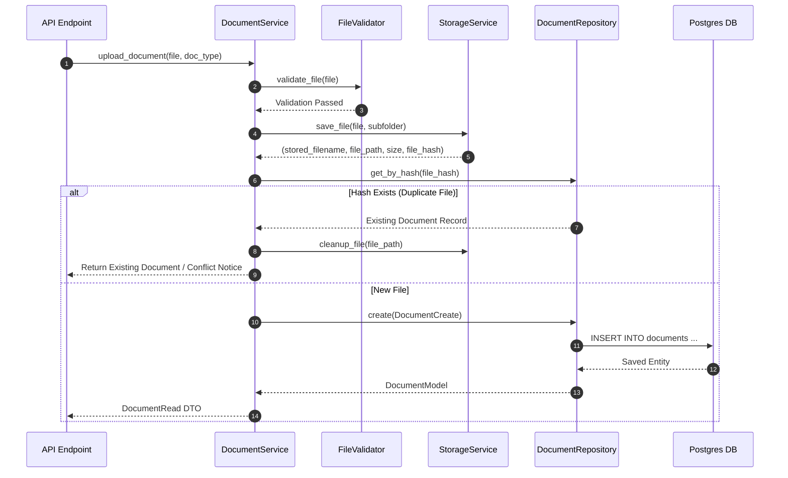

# Stage 1 Architecture Specification: Document Ingestion Subsystem

**Project**: `ai-resume-screener`  
**Stage**: Stage 1 – Document Ingestion  
**Target Stack**: Python 3.12, FastAPI, SQLAlchemy 2.0 (Async), Alembic, PostgreSQL, Pydantic v2  
**Role**: Principal Software Architect  
**Status**: Approved Technical Specification for Codex Implementation  

---

## Executive Overview

Stage 1 establishes a production-grade, secure **Document Ingestion Subsystem** for processing resumes and job descriptions.

### Core Capabilities
* Dual document type support: Resumes and Job Descriptions.
* Supported formats: `.pdf`, `.docx`, `.txt`.
* Strict 3-tier validation: Extension, MIME type / Magic Bytes, and File Size boundaries (10MB max).
* Secure file storage under `storage/uploads/` with UUIDv4 filename sanitization to prevent Path Traversal.
* Cryptographic file hashing (SHA-256) for deduplication and payload integrity.
* Metadata persistence in PostgreSQL using SQLAlchemy 2.0 Async ORM.
* Future-proof pipeline readiness: Employs status state machines (`UPLOADED`, `PARSING_PENDING`, `PARSED`, `FAILED`) to decoupled ingestion from future Stage 2/3 parsing engines.

### Strict Scope Exclusions
* **NO** resume text parsing or OCR.
* **NO** AI/LLM scoring, ranking, or embedding generation.
* **NO** authentication logic or user authorization checks.

---

## 1. API Contracts & Endpoints

All endpoints are registered under `/api/v1` and follow standard JSON response contracts. File downloads use HTTP binary streaming (`FileResponse` / `StreamingResponse`).

### Endpoint Summary

| HTTP Method | Route | Description | Content-Type |
| :--- | :--- | :--- | :--- |
| `POST` | `/api/v1/resumes/upload` | Upload resume file(s) | `multipart/form-data` |
| `GET` | `/api/v1/resumes` | List uploaded resumes (paginated) | `application/json` |
| `GET` | `/api/v1/resumes/{resume_id}` | Get metadata of specific resume | `application/json` |
| `GET` | `/api/v1/resumes/{resume_id}/download` | Stream physical resume file | `application/octet-stream` |
| `DELETE` | `/api/v1/resumes/{resume_id}` | Soft/Hard delete resume metadata & file | `application/json` |
| `POST` | `/api/v1/jobs/upload` | Upload a job description file | `multipart/form-data` |
| `GET` | `/api/v1/jobs` | List uploaded job descriptions | `application/json` |
| `GET` | `/api/v1/jobs/{job_id}` | Get metadata of job description | `application/json` |
| `GET` | `/api/v1/jobs/{job_id}/download` | Stream job description file | `application/octet-stream` |
| `DELETE` | `/api/v1/jobs/{job_id}` | Delete job description metadata & file | `application/json` |

---

### Request Payload Specifications

#### `POST /api/v1/resumes/upload`
* **Headers**: `Content-Type: multipart/form-data`
* **Form Field**: `file: UploadFile` (Required)
* **Response (HTTP 201 Created)**:
```json
{
  "data": {
    "id": "550e8400-e29b-41d4-a716-446655440000",
    "document_type": "RESUME",
    "original_filename": "Senior_Python_Developer_Resume.pdf",
    "file_size_bytes": 1048576,
    "mime_type": "application/pdf",
    "file_hash": "e3b0c44298fc1c149afbf4c8996fb92427ae41e4649b934ca495991b7852b855",
    "status": "UPLOADED",
    "metadata_json": {},
    "created_at": "2026-08-06T12:00:00Z",
    "updated_at": "2026-08-06T12:00:00Z"
  }
}
```

#### `GET /api/v1/resumes?page=1&page_size=20&status=UPLOADED`
* **Response (HTTP 200 OK)**:
```json
{
  "data": {
    "items": [
      {
        "id": "550e8400-e29b-41d4-a716-446655440000",
        "document_type": "RESUME",
        "original_filename": "Senior_Python_Developer_Resume.pdf",
        "file_size_bytes": 1048576,
        "mime_type": "application/pdf",
        "file_hash": "e3b0c44298fc1c149afbf4c8996fb92427ae41e4649b934ca495991b7852b855",
        "status": "UPLOADED",
        "created_at": "2026-08-06T12:00:00Z"
      }
    ],
    "total": 1,
    "page": 1,
    "page_size": 20,
    "total_pages": 1
  }
}
```

---

## 2. Database Schema & Migration Specification

### PostgreSQL Table Definition (`documents`)

```sql
CREATE TYPE document_type_enum AS ENUM ('RESUME', 'JOB_DESCRIPTION');
CREATE TYPE processing_status_enum AS ENUM ('UPLOADED', 'PARSING_PENDING', 'PARSED', 'FAILED');

CREATE TABLE documents (
    id UUID PRIMARY KEY DEFAULT gen_random_uuid(),
    document_type document_type_enum NOT NULL,
    original_filename VARCHAR(255) NOT NULL,
    stored_filename VARCHAR(255) NOT NULL UNIQUE,
    file_path VARCHAR(512) NOT NULL,
    file_size_bytes BIGINT NOT NULL,
    mime_type VARCHAR(128) NOT NULL,
    file_hash VARCHAR(64) NOT NULL,
    status processing_status_enum NOT NULL DEFAULT 'UPLOADED',
    metadata_json JSONB NOT NULL DEFAULT '{}'::jsonb,
    created_at TIMESTAMPTZ NOT NULL DEFAULT NOW(),
    updated_at TIMESTAMPTZ NOT NULL DEFAULT NOW(),
    deleted_at TIMESTAMPTZ NULL
);

-- Performance & Query Optimization Indexes
CREATE INDEX ix_documents_document_type ON documents(document_type);
CREATE INDEX ix_documents_status ON documents(status);
CREATE INDEX ix_documents_file_hash ON documents(file_hash);
CREATE INDEX ix_documents_created_at ON documents(created_at DESC);
```

---

## 3. SQLAlchemy Model Design (`app/models/document.py`)

Models inherit from `Base`, `UUIDMixin`, and `TimestampMixin` defined in `app.db`.

```text
app/models/document.py
├── DocumentModel (SQLAlchemy 2.0 Mapped Table)
│   ├── id: Mapped[uuid.UUID] (UUIDMixin)
│   ├── document_type: Mapped[DocumentTypeEnum] (Enum)
│   ├── original_filename: Mapped[str] (String(255))
│   ├── stored_filename: Mapped[str] (String(255), Unique)
│   ├── file_path: Mapped[str] (String(512))
│   ├── file_size_bytes: Mapped[int] (BigInteger)
│   ├── mime_type: Mapped[str] (String(128))
│   ├── file_hash: Mapped[str] (String(64), Index)
│   ├── status: Mapped[ProcessingStatusEnum] (Enum)
│   ├── metadata_json: Mapped[dict] (JSONB)
│   ├── created_at: Mapped[datetime] (TimestampMixin)
│   ├── updated_at: Mapped[datetime] (TimestampMixin)
│   └── deleted_at: Mapped[Optional[datetime]] (Nullable TIMESTAMPTZ)
```

---

## 4. Pydantic Schemas (`app/schemas/document.py`)

```python
# Enums
class DocumentType(str, Enum):
    RESUME = "RESUME"
    JOB_DESCRIPTION = "JOB_DESCRIPTION"

class ProcessingStatus(str, Enum):
    UPLOADED = "UPLOADED"
    PARSING_PENDING = "PARSING_PENDING"
    PARSED = "PARSED"
    FAILED = "FAILED"

# Schemas
class DocumentBase(BaseModel):
    document_type: DocumentType
    original_filename: str
    file_size_bytes: int
    mime_type: str
    file_hash: str
    status: ProcessingStatus = ProcessingStatus.UPLOADED

class DocumentCreate(DocumentBase):
    stored_filename: str
    file_path: str
    metadata_json: dict[str, Any] = {}

class DocumentRead(DocumentBase):
    id: UUID4
    metadata_json: dict[str, Any]
    created_at: datetime
    updated_at: datetime
    model_config = ConfigDict(from_attributes=True)

class DocumentPaginatedResponse(BaseModel):
    items: list[DocumentRead]
    total: int
    page: int
    page_size: int
    total_pages: int
```

---

## 5. Repository Layer Architecture (`app/repositories/document_repository.py`)

The `DocumentRepository` encapsulates all database operations, insulating services from raw SQL or ORM queries.

```text
DocumentRepository Methods:
├── async def create(document: DocumentCreate) -> DocumentModel
├── async def get_by_id(document_id: UUID4) -> Optional[DocumentModel]
├── async def get_by_hash(file_hash: str) -> Optional[DocumentModel]
├── async def list_documents(
│       document_type: Optional[DocumentType], 
│       status: Optional[ProcessingStatus], 
│       page: int, 
│       page_size: int
│   ) -> tuple[list[DocumentModel], int]
├── async def update_status(document_id: UUID4, status: ProcessingStatus, metadata: dict) -> DocumentModel
└── async def soft_delete(document_id: UUID4) -> bool
```

---

## 6. Service Layer Architecture

### 6.1 Storage Service (`app/services/storage_service.py`)
Manages physical disk I/O under `storage/uploads/`:

* **Directory Routing**:
  - Resumes -> `storage/uploads/resumes/`
  - Job Descriptions -> `storage/uploads/job_descriptions/`
* **Core Service Operations**:
  - `save_file(file: UploadFile, subfolder: str) -> tuple[stored_filename, file_path, file_size, SHA256_hash]`
  - `get_file_path(stored_filename: str, subfolder: str) -> Path`
  - `delete_file(file_path: str) -> bool`

### 6.2 Document Service (`app/services/document_service.py`)
Coordinates validation, physical storage, and database persistence:



---

## 7. File Validation Strategy (`app/utils/file_validation.py`)

A 3-tier validation guard checks incoming streams before writing to disk:

```text
Incoming UploadStream
        │
        ▼
[Tier 1: Extension Check] ──► Allowed: .pdf, .docx, .txt
        │ (Pass)
        ▼
[Tier 2: Size Limit Check] ──► Max Allowed: 10,485,760 bytes (10 MB)
        │ (Pass)
        ▼
[Tier 3: MIME / Magic Bytes Inspection] ──► Inspect first 2048 bytes via python-magic / struct
        │                                  Allowed: application/pdf, 
        │                                           application/vnd.openxmlformats-officedocument.wordprocessingml.document,
        │                                           text/plain
        ▼
Valid Stream Approved
```

### Validation Constants (`app/core/constants.py`)
```python
ALLOWED_EXTENSIONS = {".pdf", ".docx", ".txt"}
ALLOWED_MIME_TYPES = {
    "application/pdf",
    "application/vnd.openxmlformats-officedocument.wordprocessingml.document",
    "text/plain",
}
MAX_FILE_SIZE_BYTES = 10 * 1024 * 1024  # 10 MB
```

---

## 8. Storage Strategy & Directory Hierarchy

Files are stored in the monorepo root directory under `storage/uploads/` using sanitized, non-predictable UUIDv4 names.

```text
storage/
└── uploads/
    ├── resumes/
    │   ├── 8f0a23bc-11b3-461d-9e66-6b21bc089df2.pdf
    │   └── c3094775-6804-4861-a0c3-04870f2095f9.docx
    └── job_descriptions/
        └── a1b2c3d4-e5f6-7890-abcd-ef1234567890.txt
```

---

## 9. Error Handling & Custom Exceptions

Mapped to `app.core.exceptions.AppException` hierarchy:

| Exception Class | HTTP Code | Error Code String | Trigger Scenario |
| :--- | :---: | :--- | :--- |
| `InvalidFileTypeException` | 400 | `INVALID_FILE_TYPE` | Extension or MIME type not in allowed list |
| `FileTooLargeException` | 413 | `FILE_TOO_LARGE` | File payload exceeds 10 MB boundary |
| `DocumentNotFoundException` | 404 | `DOCUMENT_NOT_FOUND` | Document ID does not exist in DB |
| `DuplicateDocumentException` | 409 | `DUPLICATE_DOCUMENT` | SHA-256 file hash already exists |
| `StorageIOException` | 500 | `STORAGE_ERROR` | File write or permissions failure on disk |

---

## 10. Structured Logging Events

Log events produced during document processing automatically include `correlation_id` and document attributes:

```json
{
  "timestamp": "2026-08-06T12:05:00Z",
  "level": "INFO",
  "correlation_id": "c3094775-6804-4861-a0c3-04870f2095f9",
  "logger": "app.services.document_service",
  "event": "document_uploaded_successfully",
  "document_id": "550e8400-e29b-41d4-a716-446655440000",
  "document_type": "RESUME",
  "original_filename": "Senior_Python_Developer_Resume.pdf",
  "file_size_bytes": 1048576,
  "file_hash": "e3b0c44298fc1c149afbf4c8996fb92427ae41e4649b934ca495991b7852b855",
  "duration_ms": 14.8
}
```

---

## 11. Testing Strategy

### 11.1 Unit Tests (`tests/unit/`)
* `test_file_validation.py`: Test extension filtering, MIME byte signature verification, oversize rejection.
* `test_storage_service.py`: Test saving files, path generation, SHA-256 hash generation, file deletion.

### 11.2 Integration Tests (`tests/integration/`)
* `test_document_repository.py`: Test SQL queries (CRUD, soft-delete, pagination, filtering by `document_type`).

### 11.3 E2E Endpoint Tests (`tests/e2e/`)
* `test_resume_upload_api.py`: Test `POST /api/v1/resumes/upload` with valid PDF/DOCX mock files and invalid file payloads using `httpx.AsyncClient`.
* `test_job_upload_api.py`: Test `POST /api/v1/jobs/upload` and file streaming download `GET /api/v1/jobs/{job_id}/download`.

---

## 12. Implementation Plan for Codex

### Files to Create
```text
backend/app/models/document.py
backend/app/schemas/document.py
backend/app/repositories/document_repository.py
backend/app/services/storage_service.py
backend/app/services/document_service.py
backend/app/utils/file_validation.py
backend/app/api/v1/endpoints/resumes.py
backend/app/api/v1/endpoints/jobs.py
backend/alembic/versions/<timestamp>_create_documents_table.py
tests/unit/test_file_validation.py
tests/unit/test_storage_service.py
tests/integration/test_document_repository.py
tests/e2e/test_document_upload_api.py
```

### Files to Modify
```text
backend/app/core/constants.py     # Add file validation constants & document enums
backend/app/models/__init__.py    # Export DocumentModel
backend/app/api/v1/router.py      # Mount resumes.py and jobs.py routers
```
