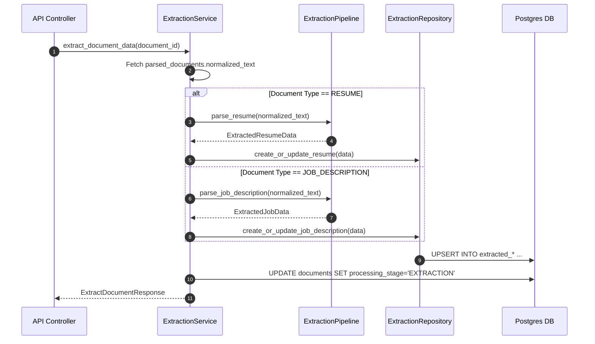

# Stage 3 Architecture Specification: Information Extraction Subsystem

**Project**: `ai-resume-screener`  
**Subsystem**: Stage 3 – Rule-Based & Pattern Information Extraction Subsystem  
**Target Stack**: Python 3.12, FastAPI, SQLAlchemy 2.0 (Async), Alembic, PostgreSQL, Pydantic v2  
**Role**: Principal Software Architect  
**Status**: Approved Technical Specification for Codex Implementation  

---

## Executive Overview

Stage 3 transforms normalized text strings generated in Stage 2 (`parsed_documents.normalized_text`) into structured entity data models for resumes and job descriptions.

### Core Capabilities
* **Resume Entity Extraction**: Extracts candidate Name, Email, Phone, Designation, Location, Skills, Education history, Work Experience, Projects, Certifications, Companies, and Languages.
* **Job Description Extraction**: Extracts Required Skills, Responsibilities, Education criteria, Experience requirements, Certifications, Industry Domain, and Role Keywords.
* **Pattern & Rule-Based Pipeline**: Employs deterministic regex, section segmentation algorithms, and gazetteer keyword matching.
* **PostgreSQL Storage**: Persists structured data in dedicated `extracted_resumes` and `extracted_job_descriptions` tables.

### Strict Scope Exclusions
* **NO** LLMs or generative AI APIs.
* **NO** Embeddings or vector database indexing.
* **NO** Semantic search or fuzzy vector matching.
* **NO** Candidate scoring, ranking, or job matching.
* **NO** Normalization or weighting metrics.

---

## 1. Database Schema Changes

### 1.1 `extracted_resumes` Table

```sql
CREATE TABLE extracted_resumes (
    id UUID PRIMARY KEY DEFAULT gen_random_uuid(),
    document_id UUID NOT NULL UNIQUE REFERENCES documents(id) ON DELETE CASCADE,
    candidate_name VARCHAR(255) NULL,
    email VARCHAR(255) NULL,
    phone VARCHAR(64) NULL,
    designation VARCHAR(255) NULL,
    location VARCHAR(255) NULL,
    skills JSONB NOT NULL DEFAULT '[]'::jsonb,
    education JSONB NOT NULL DEFAULT '[]'::jsonb,
    experience JSONB NOT NULL DEFAULT '[]'::jsonb,
    projects JSONB NOT NULL DEFAULT '[]'::jsonb,
    certifications JSONB NOT NULL DEFAULT '[]'::jsonb,
    companies JSONB NOT NULL DEFAULT '[]'::jsonb,
    languages JSONB NOT NULL DEFAULT '[]'::jsonb,
    raw_metadata JSONB NOT NULL DEFAULT '{}'::jsonb,
    created_at TIMESTAMPTZ NOT NULL DEFAULT NOW(),
    updated_at TIMESTAMPTZ NOT NULL DEFAULT NOW()
);

CREATE INDEX ix_extracted_resumes_document_id ON extracted_resumes(document_id);
CREATE INDEX ix_extracted_resumes_email ON extracted_resumes(email);
```

### 1.2 `extracted_job_descriptions` Table

```sql
CREATE TABLE extracted_job_descriptions (
    id UUID PRIMARY KEY DEFAULT gen_random_uuid(),
    document_id UUID NOT NULL UNIQUE REFERENCES documents(id) ON DELETE CASCADE,
    domain VARCHAR(255) NULL,
    skills JSONB NOT NULL DEFAULT '[]'::jsonb,
    responsibilities JSONB NOT NULL DEFAULT '[]'::jsonb,
    education JSONB NOT NULL DEFAULT '[]'::jsonb,
    experience JSONB NOT NULL DEFAULT '[]'::jsonb,
    certifications JSONB NOT NULL DEFAULT '[]'::jsonb,
    keywords JSONB NOT NULL DEFAULT '[]'::jsonb,
    raw_metadata JSONB NOT NULL DEFAULT '{}'::jsonb,
    created_at TIMESTAMPTZ NOT NULL DEFAULT NOW(),
    updated_at TIMESTAMPTZ NOT NULL DEFAULT NOW()
);

CREATE INDEX ix_extracted_job_descriptions_document_id ON extracted_job_descriptions(document_id);
```

---

## 2. SQLAlchemy Models (`app/models/extracted_info.py`)

Models inherit from `Base`, `UUIDMixin`, and `TimestampMixin`.

```text
app/models/extracted_info.py
├── ExtractedResumeModel (SQLAlchemy 2.0 Declarative Table)
│   ├── id: Mapped[uuid.UUID] (UUIDMixin Primary Key)
│   ├── document_id: Mapped[uuid.UUID] (ForeignKey("documents.id", ondelete="CASCADE"), unique=True)
│   ├── candidate_name: Mapped[Optional[str]] (String(255))
│   ├── email: Mapped[Optional[str]] (String(255), index=True)
│   ├── phone: Mapped[Optional[str]] (String(64))
│   ├── designation: Mapped[Optional[str]] (String(255))
│   ├── location: Mapped[Optional[str]] (String(255))
│   ├── skills: Mapped[list] (JSONB, default=[])
│   ├── education: Mapped[list] (JSONB, default=[])
│   ├── experience: Mapped[list] (JSONB, default=[])
│   ├── projects: Mapped[list] (JSONB, default=[])
│   ├── certifications: Mapped[list] (JSONB, default=[])
│   ├── companies: Mapped[list] (JSONB, default=[])
│   ├── languages: Mapped[list] (JSONB, default=[])
│   └── raw_metadata: Mapped[dict] (JSONB, default={})
│
└── ExtractedJobDescriptionModel (SQLAlchemy 2.0 Declarative Table)
    ├── id: Mapped[uuid.UUID] (UUIDMixin Primary Key)
    ├── document_id: Mapped[uuid.UUID] (ForeignKey("documents.id", ondelete="CASCADE"), unique=True)
    ├── domain: Mapped[Optional[str]] (String(255))
    ├── skills: Mapped[list] (JSONB, default=[])
    ├── responsibilities: Mapped[list] (JSONB, default=[])
    ├── education: Mapped[list] (JSONB, default=[])
    ├── experience: Mapped[list] (JSONB, default=[])
    ├── certifications: Mapped[list] (JSONB, default=[])
    ├── keywords: Mapped[list] (JSONB, default=[])
    └── raw_metadata: Mapped[dict] (JSONB, default={})
```

---

## 3. Pydantic Schemas (`app/schemas/extracted_info.py`)

```python
# Nested Item Structures
class EducationItem(BaseModel):
    degree: Optional[str] = None
    institution: Optional[str] = None
    year: Optional[str] = None
    field_of_study: Optional[str] = None

class ExperienceItem(BaseModel):
    company: Optional[str] = None
    title: Optional[str] = None
    duration: Optional[str] = None
    responsibilities: list[str] = []

class ProjectItem(BaseModel):
    name: Optional[str] = None
    description: Optional[str] = None
    technologies: list[str] = []

# Extracted Resume DTOs
class ExtractedResumeRead(BaseModel):
    id: UUID4
    document_id: UUID4
    candidate_name: Optional[str] = None
    email: Optional[str] = None
    phone: Optional[str] = None
    designation: Optional[str] = None
    location: Optional[str] = None
    skills: list[str] = []
    education: list[EducationItem] = []
    experience: list[ExperienceItem] = []
    projects: list[ProjectItem] = []
    certifications: list[str] = []
    companies: list[str] = []
    languages: list[str] = []
    created_at: datetime
    model_config = ConfigDict(from_attributes=True)

# Extracted Job Description DTOs
class ExtractedJobDescriptionRead(BaseModel):
    id: UUID4
    document_id: UUID4
    domain: Optional[str] = None
    skills: list[str] = []
    responsibilities: list[str] = []
    education: list[str] = []
    experience: list[str] = []
    certifications: list[str] = []
    keywords: list[str] = []
    created_at: datetime
    model_config = ConfigDict(from_attributes=True)

class ExtractDocumentResponse(BaseModel):
    document_id: UUID4
    document_type: str
    processing_stage: str = "EXTRACTION"
    message: str
```

---

## 4. Repository Responsibilities (`app/repositories/extraction_repository.py`)

The `ExtractionRepository` handles database persistence for structured entities:

* `create_or_update_resume(data: dict) -> ExtractedResumeModel`
* `create_or_update_job_description(data: dict) -> ExtractedJobDescriptionModel`
* `get_resume_by_document_id(document_id: UUID4) -> Optional[ExtractedResumeModel]`
* `get_job_description_by_document_id(document_id: UUID4) -> Optional[ExtractedJobDescriptionModel]`

---

## 5. Service Responsibilities (`app/services/extraction_service.py`)

The `ExtractionService` coordinates the extraction workflow:



---

## 6. Extraction Pipeline Design (`app/services/pipeline/extraction_pipeline.py`)

A deterministic 4-step pipeline processes `normalized_text`:

```text
Normalized Text String
       │
       ▼
[Step 1: Section Segmentation] ──► Splits text into section blocks (CONTACT, SKILLS, EXPERIENCE, EDUCATION)
       │
       ▼
[Step 2: Regex Contact Extraction] ──► Extracts Email, Phone Number, URLs via pre-compiled regex
       │
       ▼
[Step 3: Pattern & Dictionary Matching] ──► Matches Skills, Degrees, Designations against gazetteers
       │
       ▼
[Step 4: Block Parsing] ──► Extracts Experience & Education structured objects
       │
       ▼
Structured Entity Schema Output
```

---

## 7. Supported Extractors (`app/services/extractors/`)

* **`ResumeExtractor` (`app/services/extractors/resume_extractor.py`)**:
  - Email Regex: `r"[\w\.-]+@[\w\.-]+\.\w+"`
  - Phone Regex: `r"\(?\+?\d{1,4}\)?[\s.-]?\d{3,5}[\s.-]?\d{4}"`
  - Section Headers: `"EXPERIENCE"`, `"WORK HISTORY"`, `"EDUCATION"`, `"SKILLS"`, `"PROJECTS"`, `"CERTIFICATIONS"`.
  - Skill Matcher: Matches text against compiled technical skill dictionary (`Python`, `FastAPI`, `PostgreSQL`, `React`, `Docker`, `SQL`, etc.).

* **`JobDescriptionExtractor` (`app/services/extractors/job_extractor.py`)**:
  - Section Headers: `"REQUIREMENTS"`, `"QUALIFICATIONS"`, `"RESPONSIBILITIES"`, `"BENEFITS"`.
  - Skill & Keyword Matcher: Extracts required technical skills, experience prerequisites (e.g., "5+ years"), and education criteria.

---

## 8. API Contracts (`app/api/v1/endpoints/extraction.py`)

### 8.1 `POST /api/v1/documents/{document_id}/extract`
* **Description**: Trigger information extraction pipeline on a parsed document.
* **Response (HTTP 200 OK)**:
```json
{
  "data": {
    "document_id": "550e8400-e29b-41d4-a716-446655440000",
    "document_type": "RESUME",
    "processing_stage": "EXTRACTION",
    "message": "Information extracted successfully."
  }
}
```

### 8.2 `GET /api/v1/documents/{document_id}/extracted`
* **Description**: Retrieve extracted structured candidate or job data.
* **Response (HTTP 200 OK - Resume Example)**:
```json
{
  "data": {
    "id": "11223344-5566-7788-9900-aabbccddeeff",
    "document_id": "550e8400-e29b-41d4-a716-446655440000",
    "candidate_name": "John Doe",
    "email": "john.doe@example.com",
    "phone": "+1-555-0199",
    "designation": "Senior Backend Engineer",
    "location": "San Francisco, CA",
    "skills": ["Python", "FastAPI", "SQLAlchemy", "PostgreSQL", "Docker", "Pytest"],
    "education": [
      {
        "degree": "Bachelor of Science",
        "institution": "University of California",
        "year": "2020",
        "field_of_study": "Computer Science"
      }
    ],
    "experience": [
      {
        "company": "Tech Corp",
        "title": "Senior Python Developer",
        "duration": "2021 - Present",
        "responsibilities": ["Built scalable FastAPI microservices", "Optimized PostgreSQL queries"]
      }
    ],
    "projects": [
      {
        "name": "AI Resume Screener",
        "description": "Monorepo backend platform",
        "technologies": ["FastAPI", "PostgreSQL"]
      }
    ],
    "certifications": ["AWS Certified Solutions Architect"],
    "companies": ["Tech Corp"],
    "languages": ["English"],
    "created_at": "2026-08-06T15:00:00Z"
  }
}
```

---

## 9. Error Handling & Custom Exceptions

Mapped to `app.core.exceptions.AppException`:

| Exception Class | HTTP Code | Error Code String | Trigger Scenario |
| :--- | :---: | :--- | :--- |
| `ParsedTextNotFoundException` | 400 | `PARSED_TEXT_NOT_FOUND` | Document has not been parsed in Stage 2 |
| `ExtractionFailedException` | 500 | `EXTRACTION_FAILED` | Internal pipeline failure during regex/regex parsing |
| `ExtractedDataNotFoundException` | 404 | `EXTRACTED_DATA_NOT_FOUND` | No extracted record exists for document ID |

---

## 10. Testing Strategy

### 10.1 Unit Tests (`tests/unit/`)
* `test_regex_extractors.py`: Test email, phone number, and URL regex patterns across various format strings.
* `test_section_segmentation.py`: Test splitting text into section blocks.
* `test_skill_matching.py`: Test skill gazetteer dictionary matching.

### 10.2 Integration Tests (`tests/integration/`)
* `test_extraction_repository.py`: Test upserting and fetching `ExtractedResumeModel` and `ExtractedJobDescriptionModel` in PostgreSQL.

### 10.3 E2E Endpoint Tests (`tests/e2e/`)
* `test_extraction_api.py`: Test `POST /api/v1/documents/{document_id}/extract` and `GET /api/v1/documents/{document_id}/extracted` via `httpx.AsyncClient`.

---

## 11. File Manifest for Codex Implementation

### Files to Create
```text
backend/app/models/extracted_info.py
backend/app/schemas/extracted_info.py
backend/app/repositories/extraction_repository.py
backend/app/services/extraction_service.py
backend/app/services/extractors/resume_extractor.py
backend/app/services/extractors/job_extractor.py
backend/app/services/pipeline/extraction_pipeline.py
backend/app/api/v1/endpoints/extraction.py
backend/alembic/versions/<timestamp>_create_extracted_tables.py
tests/unit/test_regex_extractors.py
tests/unit/test_section_segmentation.py
tests/integration/test_extraction_repository.py
tests/e2e/test_extraction_api.py
```

### Files to Modify
```text
backend/app/models/__init__.py        # Export ExtractedResumeModel & ExtractedJobDescriptionModel
backend/app/api/v1/router.py          # Mount extraction.py endpoint router
```
