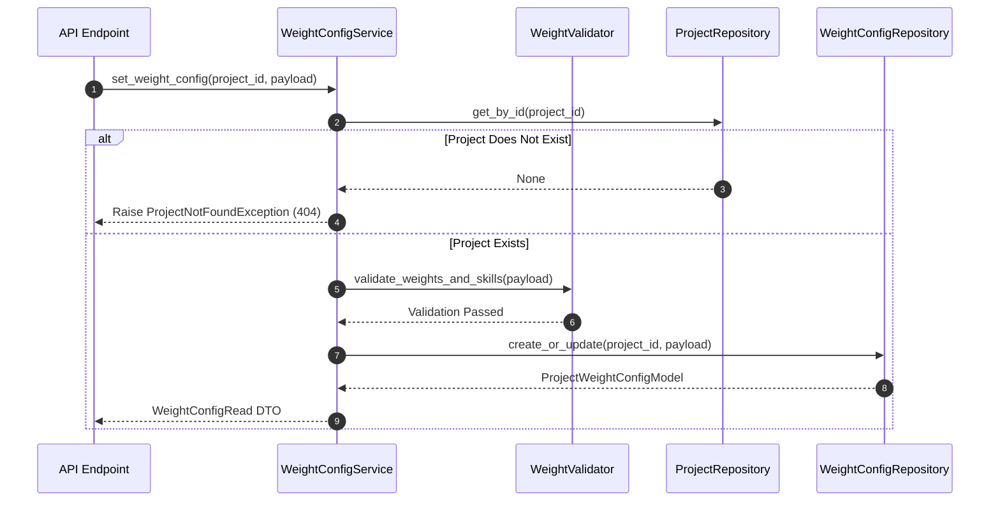

# Stage 5 Architecture Specification: Recruiter Weight Configuration Subsystem

**Project**: `ai-resume-screener`  
**Subsystem**: Stage 5 – Recruiter Weight & Rule Configuration Subsystem  
**Target Stack**: Python 3.12, FastAPI, SQLAlchemy 2.0 (Async), Alembic, PostgreSQL, Pydantic v2  
**Role**: Principal Software Architect  
**Status**: Approved Technical Specification for Codex Implementation  

---

## Executive Overview

Stage 5 introduces the **Recruiter Weight & Rule Configuration Subsystem**. It empowers recruiters to define evaluation criteria, weight distributions, mandatory constraints, and knockout rules on a per-project basis prior to candidate scoring in Stage 6.

### Core Capabilities
* **Custom Weight Distribution**: Configurable weights for Skills, Experience, Projects, Education, Certifications, and Languages (strictly enforced to total 100%).
* **Mandatory & Preferred Requirements**: Explicit lists of required and preferred skills/certifications.
* **Knockout Rules Engine Configuration**: Declarative rules for auto-disqualifying non-compliant candidates (e.g., missing mandatory skill, experience below minimum cutoff).
* **Threshold Settings**: Minimum experience cutoff (years), required degree level, and custom passing score (e.g., 70%).

### Strict Scope Exclusions
* **NO** candidate scoring or score calculation execution.
* **NO** candidate ranking or candidate sorting.
* **NO** LLM calls or AI prompts.
* **NO** Vector embeddings or semantic matching.

---

## 1. Database Schema (`project_weight_configs` Table)

```sql
CREATE TABLE project_weight_configs (
    id UUID PRIMARY KEY DEFAULT gen_random_uuid(),
    project_id UUID NOT NULL UNIQUE REFERENCES projects(id) ON DELETE CASCADE,
    
    -- Weight Breakdown (Must sum to 100.00)
    skills_weight NUMERIC(5,2) NOT NULL DEFAULT 40.00,
    experience_weight NUMERIC(5,2) NOT NULL DEFAULT 25.00,
    projects_weight NUMERIC(5,2) NOT NULL DEFAULT 15.00,
    education_weight NUMERIC(5,2) NOT NULL DEFAULT 10.00,
    certifications_weight NUMERIC(5,2) NOT NULL DEFAULT 5.00,
    languages_weight NUMERIC(5,2) NOT NULL DEFAULT 5.00,
    
    -- Thresholds & Hard Criteria
    passing_score NUMERIC(5,2) NOT NULL DEFAULT 70.00,
    min_experience_years NUMERIC(4,1) NOT NULL DEFAULT 0.0,
    required_degree VARCHAR(255) NULL,
    required_certifications JSONB NOT NULL DEFAULT '[]'::jsonb,
    
    -- Skill Requirements
    mandatory_skills JSONB NOT NULL DEFAULT '[]'::jsonb,
    preferred_skills JSONB NOT NULL DEFAULT '[]'::jsonb,
    
    -- Knockout & Custom Rules
    knockout_rules JSONB NOT NULL DEFAULT '[]'::jsonb,
    custom_keywords JSONB NOT NULL DEFAULT '[]'::jsonb,
    
    created_at TIMESTAMPTZ NOT NULL DEFAULT NOW(),
    updated_at TIMESTAMPTZ NOT NULL DEFAULT NOW(),
    
    -- Database Constraints
    CONSTRAINT ck_total_weights CHECK (
        (skills_weight + experience_weight + projects_weight + education_weight + certifications_weight + languages_weight) = 100.00
    )
);

CREATE INDEX ix_project_weight_configs_project_id ON project_weight_configs(project_id);
```

---

## 2. SQLAlchemy Model (`app/models/weight_config.py`)

Inherits from `Base`, `UUIDMixin`, and `TimestampMixin`.

```text
app/models/weight_config.py
└── ProjectWeightConfigModel (SQLAlchemy 2.0 Declarative Table)
    ├── id: Mapped[uuid.UUID] (UUIDMixin Primary Key)
    ├── project_id: Mapped[uuid.UUID] (ForeignKey("projects.id", ondelete="CASCADE"), unique=True)
    ├── skills_weight: Mapped[float] (Numeric(5,2), default=40.0)
    ├── experience_weight: Mapped[float] (Numeric(5,2), default=25.0)
    ├── projects_weight: Mapped[float] (Numeric(5,2), default=15.0)
    ├── education_weight: Mapped[float] (Numeric(5,2), default=10.0)
    ├── certifications_weight: Mapped[float] (Numeric(5,2), default=5.0)
    ├── languages_weight: Mapped[float] (Numeric(5,2), default=5.0)
    ├── passing_score: Mapped[float] (Numeric(5,2), default=70.0)
    ├── min_experience_years: Mapped[float] (Numeric(4,1), default=0.0)
    ├── required_degree: Mapped[Optional[str]] (String(255), nullable=True)
    ├── required_certifications: Mapped[list] (JSONB, default=[])
    ├── mandatory_skills: Mapped[list] (JSONB, default=[])
    ├── preferred_skills: Mapped[list] (JSONB, default=[])
    ├── knockout_rules: Mapped[list] (JSONB, default=[])
    ├── custom_keywords: Mapped[list] (JSONB, default=[])
    ├── created_at: Mapped[datetime] (TimestampMixin, UTC)
    ├── updated_at: Mapped[datetime] (TimestampMixin, UTC)
    └── project: Mapped["ProjectModel"] (relationship("ProjectModel", back_populates="weight_config"))
```

---

## 3. Pydantic Schemas (`app/schemas/weight_config.py`)

```python
# Weight Component DTO
class WeightDistribution(BaseModel):
    skills: float = Field(40.0, ge=0.0, le=100.0)
    experience: float = Field(25.0, ge=0.0, le=100.0)
    projects: float = Field(15.0, ge=0.0, le=100.0)
    education: float = Field(10.0, ge=0.0, le=100.0)
    certifications: float = Field(5.0, ge=0.0, le=100.0)
    languages: float = Field(5.0, ge=0.0, le=100.0)

    @model_validator(mode="after")
    def validate_total_weight(self) -> "WeightDistribution":
        total = sum([self.skills, self.experience, self.projects, self.education, self.certifications, self.languages])
        if abs(total - 100.0) > 0.01:
            raise ValueError(f"Total weights must sum to exactly 100.0%. Current sum: {total:.2f}%")
        return self

# Knockout Rule DTO
class KnockoutRule(BaseModel):
    rule_type: str = Field(..., example="MISSING_MANDATORY_SKILL")
    enabled: bool = True
    description: Optional[str] = None

# Weight Configuration DTOs
class WeightConfigCreate(BaseModel):
    weights: WeightDistribution = Field(default_factory=WeightDistribution)
    passing_score: float = Field(70.0, ge=0.0, le=100.0)
    min_experience_years: float = Field(0.0, ge=0.0, le=50.0)
    required_degree: Optional[str] = None
    required_certifications: list[str] = []
    mandatory_skills: list[str] = []
    preferred_skills: list[str] = []
    knockout_rules: list[KnockoutRule] = []
    custom_keywords: list[str] = []

    @field_validator("mandatory_skills")
    def validate_unique_skills(cls, v: list[str]) -> list[str]:
        cleaned = [s.strip().lower() for s in v if s.strip()]
        if len(cleaned) != len(set(cleaned)):
            raise ValueError("Duplicate mandatory skills are not allowed.")
        return v

class WeightConfigUpdate(BaseModel):
    weights: Optional[WeightDistribution] = None
    passing_score: Optional[float] = Field(None, ge=0.0, le=100.0)
    min_experience_years: Optional[float] = Field(None, ge=0.0, le=50.0)
    required_degree: Optional[str] = None
    required_certifications: Optional[list[str]] = None
    mandatory_skills: Optional[list[str]] = None
    preferred_skills: Optional[list[str]] = None
    knockout_rules: Optional[list[KnockoutRule]] = None
    custom_keywords: Optional[list[str]] = None

class WeightConfigRead(BaseModel):
    id: UUID4
    project_id: UUID4
    weights: WeightDistribution
    passing_score: float
    min_experience_years: float
    required_degree: Optional[str]
    required_certifications: list[str]
    mandatory_skills: list[str]
    preferred_skills: list[str]
    knockout_rules: list[KnockoutRule]
    custom_keywords: list[str]
    created_at: datetime
    updated_at: datetime
    model_config = ConfigDict(from_attributes=True)
```

---

## 4. Repository Responsibilities (`app/repositories/weight_config_repository.py`)

* `create_or_update(project_id: UUID4, config_in: WeightConfigCreate) -> ProjectWeightConfigModel`
* `get_by_project_id(project_id: UUID4) -> Optional[ProjectWeightConfigModel]`
* `delete_by_project_id(project_id: UUID4) -> bool`

---

## 5. Service Responsibilities (`app/services/weight_config_service.py`)



---

## 6. Weight Calculation & Normalization Model

The mathematical weight evaluation model specifies:

$$\text{TotalWeight} = W_{\text{skills}} + W_{\text{exp}} + W_{\text{proj}} + W_{\text{edu}} + W_{\text{cert}} + W_{\text{lang}} = 100.0\%$$

If a recruiter disables a category (e.g. `languages_weight = 0.0%`), the remaining weights must be adjusted by the recruiter to maintain $\sum W_i = 100.0\%$.

---

## 7. Mandatory & Knockout Rule Model

Knockout rules evaluate candidate eligibility before overall scoring:

1. **`MISSING_MANDATORY_SKILL`**: Triggers if candidate lacks any skill declared in `mandatory_skills`.
2. **`INSUFFICIENT_EXPERIENCE`**: Triggers if candidate total experience is less than `min_experience_years`.
3. **`DEGREE_MISMATCH`**: Triggers if candidate degree does not meet `required_degree`.

Candidates failing any enabled knockout rule are flagged as `DISQUALIFIED` in Stage 6 scoring.

---

## 8. API Contracts (`app/api/v1/endpoints/weight_config.py`)

### 8.1 `POST /api/v1/projects/{project_id}/weight-config`
* **Description**: Create weight configuration for a project.
* **Request Body**: `WeightConfigCreate`
* **Response (HTTP 201 Created)**: Returns `WeightConfigRead` DTO.

### 8.2 `GET /api/v1/projects/{project_id}/weight-config`
* **Description**: Retrieve weight configuration for a project.
* **Response (HTTP 200 OK)**: Returns `WeightConfigRead` DTO.

### 8.3 `PATCH /api/v1/projects/{project_id}/weight-config`
* **Description**: Update specific fields of a project's weight configuration.
* **Request Body**: `WeightConfigUpdate`
* **Response (HTTP 200 OK)**: Returns updated `WeightConfigRead` DTO.

### 8.4 `DELETE /api/v1/projects/{project_id}/weight-config`
* **Description**: Delete/Reset weight configuration for a project.
* **Response (HTTP 204 No Content)**: Returns empty body upon successful reset.

---

## 9. Error Handling & Custom Exceptions

Mapped to `app.core.exceptions.AppException`:

| Exception Class | HTTP Code | Error Code String | Trigger Scenario |
| :--- | :---: | :--- | :--- |
| `InvalidWeightTotalException` | 422 | `INVALID_WEIGHT_TOTAL` | Sum of category weights != 100.0% |
| `DuplicateMandatorySkillException` | 422 | `DUPLICATE_MANDATORY_SKILL` | Duplicate entry in `mandatory_skills` list |
| `ProjectNotFoundException` | 404 | `PROJECT_NOT_FOUND` | `project_id` does not exist in DB |
| `WeightConfigNotFoundException` | 404 | `WEIGHT_CONFIG_NOT_FOUND` | Configuration does not exist for project |

---

## 10. Testing Strategy

### 10.1 Unit Tests (`tests/unit/`)
* `test_weight_validation.py`: Test total weight sum calculation (validating 100% total, rejecting 95% or 105% sums).
* `test_mandatory_skill_validation.py`: Test case-insensitive duplicate skill detection.

### 10.2 Integration Tests (`tests/integration/`)
* `test_weight_config_repository.py`: Test SQL upsert and cascade deletion on `project_weight_configs`.

### 10.3 E2E Endpoint Tests (`tests/e2e/`)
* `test_weight_config_api.py`: Test `POST`, `GET`, `PATCH`, `DELETE` routes for `/api/v1/projects/{project_id}/weight-config` using `httpx.AsyncClient`.

---

## 11. File Manifest for Codex Implementation

### Files to Create
```text
backend/app/models/weight_config.py
backend/app/schemas/weight_config.py
backend/app/repositories/weight_config_repository.py
backend/app/services/weight_config_service.py
backend/app/utils/weight_validation.py
backend/app/api/v1/endpoints/weight_config.py
backend/alembic/versions/<timestamp>_create_project_weight_configs_table.py
tests/unit/test_weight_validation.py
tests/integration/test_weight_config_repository.py
tests/e2e/test_weight_config_api.py
```

### Files to Modify
```text
backend/app/models/__init__.py        # Export ProjectWeightConfigModel
backend/app/models/project.py         # Add weight_config relationship
backend/app/api/v1/router.py          # Mount weight_config.py router
```
