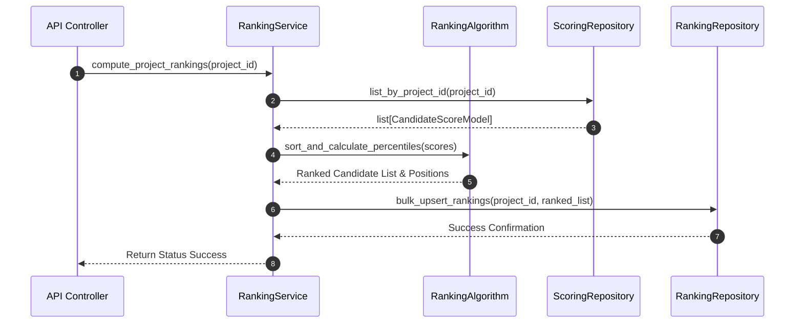

# Stage 7 Architecture Specification: Candidate Ranking Subsystem

**Project**: `ai-resume-screener`  
**Subsystem**: Stage 7 – Candidate Ranking, Leaderboard & Analytics Subsystem  
**Target Stack**: Python 3.12, FastAPI, SQLAlchemy 2.0 (Async), Alembic, PostgreSQL, Pydantic v2  
**Role**: Principal Software Architect  
**Status**: Approved Technical Specification for Codex Implementation  

---

## Executive Overview

Stage 7 introduces the **Candidate Ranking, Leaderboard & Analytics Subsystem**. It processes Stage 6 candidate scores within a hiring campaign project, applies deterministic tie-breaking algorithms, computes percentiles, and provides candidate leaderboards, search, filtering, and statistical metrics.

### Core Capabilities
* **Deterministic Multi-Tier Ranking**: Ranks candidates based on Final Score with 4-tier tie-breaker resolution.
* **Percentile Metrics**: Computes candidate percentile scores within the project campaign.
* **Project Leaderboards & Top N Queries**: Exposes top-performing candidates (`limit=10`).
* **Search & Filter Suite**: Case-insensitive candidate name/email search, recommendation level filtering, score range bounds, and knockout status toggles.
* **Campaign Statistics Engine**: Generates aggregate metrics (Total Candidates, Average/Highest/Lowest scores, Recommendation distribution, Knockout count).

### Strict Scope Exclusions
* **NO** LLM calls or natural language explanations.
* **NO** Dashboard UI components.
* **NO** Export generators (PDF/Excel/CSV exports).
* **NO** Vector embeddings or semantic matching.

---

## 1. Database Schema (`candidate_rankings` Table)

```sql
CREATE TABLE candidate_rankings (
    id UUID PRIMARY KEY DEFAULT gen_random_uuid(),
    project_id UUID NOT NULL REFERENCES projects(id) ON DELETE CASCADE,
    document_id UUID NOT NULL UNIQUE REFERENCES documents(id) ON DELETE CASCADE,
    candidate_score_id UUID NOT NULL UNIQUE REFERENCES candidate_scores(id) ON DELETE CASCADE,
    
    -- Ranking Attributes
    rank_position INTEGER NOT NULL,
    percentile NUMERIC(5,2) NOT NULL,
    
    created_at TIMESTAMPTZ NOT NULL DEFAULT NOW(),
    updated_at TIMESTAMPTZ NOT NULL DEFAULT NOW(),
    
    -- Ensure unique rank position per project
    CONSTRAINT uq_project_rank_position UNIQUE (project_id, rank_position)
);

-- Performance Indexes
CREATE INDEX ix_candidate_rankings_project_rank ON candidate_rankings(project_id, rank_position);
CREATE INDEX ix_candidate_rankings_document_id ON candidate_rankings(document_id);
```

---

## 2. SQLAlchemy Model (`app/models/ranking.py`)

Inherits from `Base`, `UUIDMixin`, and `TimestampMixin`.

```text
app/models/ranking.py
└── CandidateRankingModel (SQLAlchemy 2.0 Declarative Table)
    ├── id: Mapped[uuid.UUID] (UUIDMixin Primary Key)
    ├── project_id: Mapped[uuid.UUID] (ForeignKey("projects.id", ondelete="CASCADE"), index=True)
    ├── document_id: Mapped[uuid.UUID] (ForeignKey("documents.id", ondelete="CASCADE"), unique=True)
    ├── candidate_score_id: Mapped[uuid.UUID] (ForeignKey("candidate_scores.id", ondelete="CASCADE"), unique=True)
    ├── rank_position: Mapped[int] (Integer, nullable=False)
    ├── percentile: Mapped[float] (Numeric(5,2), nullable=False)
    ├── created_at: Mapped[datetime] (TimestampMixin, UTC)
    ├── updated_at: Mapped[datetime] (TimestampMixin, UTC)
    ├── project: Mapped["ProjectModel"] (relationship("ProjectModel", back_populates="rankings"))
    ├── score: Mapped["CandidateScoreModel"] (relationship("CandidateScoreModel"))
    └── document: Mapped["DocumentModel"] (relationship("DocumentModel"))
```

---

## 3. Pydantic Schemas (`app/schemas/ranking.py`)

```python
# Ranking Read DTO
class CandidateRankingRead(BaseModel):
    id: UUID4
    project_id: UUID4
    document_id: UUID4
    candidate_name: Optional[str] = "Anonymous Candidate"
    email: Optional[str] = None
    rank_position: int
    percentile: float
    final_score: float
    recommendation: RecommendationLevel
    confidence: float
    is_knocked_out: bool
    skills_score: float
    experience_score: float
    created_at: datetime
    model_config = ConfigDict(from_attributes=True)

# Paginated Response DTO
class ProjectRankingListResponse(BaseModel):
    items: list[CandidateRankingRead]
    total: int
    page: int
    page_size: int
    total_pages: int

# Leaderboard Response DTO
class ProjectLeaderboardResponse(BaseModel):
    project_id: UUID4
    top_n: int
    candidates: list[CandidateRankingRead]

# Statistics Response DTOs
class RecommendationDistribution(BaseModel):
    strong_match_count: int
    recommended_count: int
    needs_review_count: int
    not_recommended_count: int

class ProjectStatisticsResponse(BaseModel):
    project_id: UUID4
    total_candidates: int
    average_score: float
    highest_score: float
    lowest_score: float
    knocked_out_count: int
    recommendation_distribution: RecommendationDistribution
```

---

## 4. Repository Responsibilities (`app/repositories/ranking_repository.py`)

The `RankingRepository` manages ranking persistence and analytical queries:

* **`bulk_upsert_rankings(project_id: UUID4, rankings: list[dict]) -> bool`**: Transactionally replaces or updates project rankings.
* **`list_rankings(project_id: UUID4, filters: dict, search: Optional[str], page: int, page_size: int, sort_by: str, order: str) -> tuple[list[dict], int]`**: Joins `candidate_rankings`, `candidate_scores`, `extracted_resumes`, and `documents` to perform filtered, searched, and sorted paginated queries.
* **`get_top_n_leaderboard(project_id: UUID4, limit: int = 10) -> list[dict]`**: Returns top N ranked candidates.
* **`get_project_statistics(project_id: UUID4) -> dict`**: Calculates SQL aggregate metrics (`COUNT`, `AVG`, `MAX`, `MIN`, `GROUP BY recommendation`).

---

## 5. Service Responsibilities (`app/services/ranking_service.py`)



---

## 6. Deterministic Ranking Algorithm & Percentile Formula

### 6.1 Sort Priority Key Matrix
Candidates are sorted using a 5-tier deterministic tuple:

$$\text{SortKey} = \big(-\text{final\_score}, -S_{\text{skills}}, -S_{\text{exp}}, -\text{confidence}, \text{document.created\_at}\big)$$

### 6.2 Percentile Formula
Percentiles are computed based on rank position relative to total scored candidates $N$:

$$\text{Percentile} = \left( \frac{N - \text{rank\_position} + 1}{N} \right) \times 100$$

*(Example: Rank 1 out of 100 candidates yields a 100.00% percentile; Rank 100 yields 1.00%)*

---

## 7. Tie-Breaking Protocol

If two candidates share identical `final_score` values, ties are resolved in strict sequence:

1. **Tie-Breaker 1**: Higher Raw Skills Component Score ($S_{\text{skills}}$).
2. **Tie-Breaker 2**: Higher Raw Experience Component Score ($S_{\text{exp}}$).
3. **Tie-Breaker 3**: Higher Extraction Confidence Score.
4. **Tie-Breaker 4**: Earlier Upload Timestamp (`documents.created_at`).

---

## 8. Filtering, Searching & Sorting Capabilities

### 8.1 Filters
* `recommendation`: Filter by `STRONG_MATCH`, `RECOMMENDED`, `NEEDS_REVIEW`, `NOT_RECOMMENDED`.
* `min_score` / `max_score`: Filter candidates within a final score window (e.g. `min_score=75.0`).
* `is_knocked_out`: Filter boolean (`true` / `false`).

### 8.2 Search
* `search`: Case-insensitive `ILIKE` search matching `candidate_name` or `email` from Stage 3 `extracted_resumes`.

### 8.3 Sorting
* `sort_by`: `rank_position` (default), `final_score`, `skills_score`, `experience_score`, `confidence`, `created_at`.
* `order`: `asc` or `desc`.

---

## 9. API Contracts (`app/api/v1/endpoints/ranking.py`)

### 9.1 `POST /api/v1/projects/{project_id}/rank`
* **Description**: Compute and persist candidate rankings for all scored candidates in a project.
* **Response (HTTP 200 OK)**:
```json
{
  "data": {
    "project_id": "7c9e6679-7425-40de-944b-e07fc1f90ae7",
    "total_ranked": 25,
    "message": "Candidate rankings computed successfully."
  }
}
```

### 9.2 `GET /api/v1/projects/{project_id}/rankings`
* **Description**: Retrieve paginated project rankings with search, filtering, and sorting parameters.
* **Query Params**: `page=1`, `page_size=20`, `recommendation=STRONG_MATCH`, `search=john`, `sort_by=final_score`, `order=desc`.
* **Response (HTTP 200 OK)**: Returns `ProjectRankingListResponse`.

### 9.3 `GET /api/v1/projects/{project_id}/leaderboard?limit=10`
* **Description**: Retrieve Top N candidate leaderboard.
* **Response (HTTP 200 OK)**: Returns `ProjectLeaderboardResponse`.

### 9.4 `GET /api/v1/projects/{project_id}/statistics`
* **Description**: Retrieve project candidate campaign statistics.
* **Response (HTTP 200 OK)**:
```json
{
  "data": {
    "project_id": "7c9e6679-7425-40de-944b-e07fc1f90ae7",
    "total_candidates": 50,
    "average_score": 74.25,
    "highest_score": 96.50,
    "lowest_score": 32.00,
    "knocked_out_count": 5,
    "recommendation_distribution": {
      "strong_match_count": 8,
      "recommended_count": 22,
      "needs_review_count": 15,
      "not_recommended_count": 5
    }
  }
}
```

---

## 10. Error Handling & Custom Exceptions

Mapped to `app.core.exceptions.AppException`:

| Exception Class | HTTP Code | Error Code String | Trigger Scenario |
| :--- | :---: | :--- | :--- |
| `NoScoredCandidatesException` | 400 | `NO_SCORED_CANDIDATES` | Project has zero candidate scores in Stage 6 |
| `ProjectNotFoundException` | 404 | `PROJECT_NOT_FOUND` | `project_id` does not exist in DB |
| `RankingExecutionFailedException` | 500 | `RANKING_EXECUTION_FAILED` | Internal error during sorting or percentile math |

---

## 11. Testing Strategy

### 11.1 Unit Tests (`tests/unit/`)
* `test_ranking_algorithm.py`: Test 5-tier tie-breaker resolution matrix.
* `test_percentile_math.py`: Test percentile calculations across candidate cohorts of varying sizes.

### 11.2 Integration Tests (`tests/integration/`)
* `test_ranking_repository.py`: Test bulk upsert, paginated filtering, candidate name search, and SQL aggregate statistics.

### 11.3 E2E Endpoint Tests (`tests/e2e/`)
* `test_ranking_api.py`: Test `POST /rank`, `GET /rankings`, `GET /leaderboard`, and `GET /statistics` via `httpx.AsyncClient`.

---

## 12. File Manifest for Codex Implementation

### Files to Create
```text
backend/app/models/ranking.py
backend/app/schemas/ranking.py
backend/app/repositories/ranking_repository.py
backend/app/services/ranking_service.py
backend/app/services/ranking/ranking_algorithm.py
backend/app/api/v1/endpoints/ranking.py
backend/alembic/versions/<timestamp>_create_candidate_rankings_table.py
tests/unit/test_ranking_algorithm.py
tests/unit/test_percentile_math.py
tests/integration/test_ranking_repository.py
tests/e2e/test_ranking_api.py
```

### Files to Modify
```text
backend/app/models/__init__.py        # Export CandidateRankingModel
backend/app/models/project.py         # Add rankings relationship
backend/app/api/v1/router.py          # Mount ranking.py router
```
