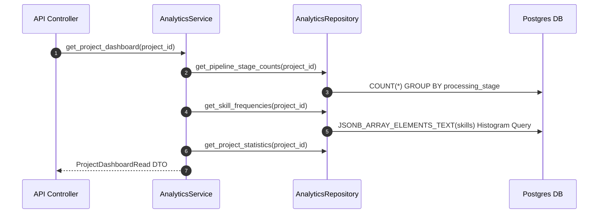

# Stage 8 Architecture Specification: AI Insights, Dashboard & Reporting Subsystem

**Project**: `ai-resume-screener`  
**Subsystem**: Stage 8 – AI Insights, Recruiter Dashboard & Campaign Reporting Subsystem  
**Target Stack**: Python 3.12, FastAPI, SQLAlchemy 2.0 (Async), Alembic, PostgreSQL, Pydantic v2, OpenPyXL, ReportLab  
**Role**: Principal Software Architect  
**Status**: Approved Technical Specification for Codex Implementation  

---

## Executive Overview

Stage 8 introduces the **AI Insights, Recruiter Dashboard & Campaign Reporting Subsystem**. It aggregates data produced across Stages 1–7 to deliver candidate-level evaluation insights, pipeline progress tracking, campaign analytics, and multi-format export capabilities (CSV, Excel, PDF).

### Core Capabilities
* **AI Candidate Explanation Engine**: Synthesizes Candidate Summaries, Strengths, Weaknesses, Matched/Missing Skills, Score Explanations, Recommendation Reasons, and Improvement Suggestions.
* **Recruiter Dashboard & Pipeline Status**: Tracks pipeline completion counts (`Ingested` -> `Parsed` -> `Extracted` -> `Normalized` -> `Scored` -> `Ranked`), candidate score distributions, and campaign health metrics.
* **Campaign Skill Analytics**: Computes top matched skills and missing skill frequency histograms across all applicants in a hiring campaign.
* **Multi-Format Export Engine**: Generates CSV reports, styled Excel workbooks (`.xlsx`), and PDF executive summary reports on demand.

---

## 1. Database Schema (`candidate_ai_insights` Table)

To optimize response latency and avoid re-calculating explanation templates, generated insights are persisted in a `candidate_ai_insights` cache table:

```sql
CREATE TABLE candidate_ai_insights (
    id UUID PRIMARY KEY DEFAULT gen_random_uuid(),
    document_id UUID NOT NULL UNIQUE REFERENCES documents(id) ON DELETE CASCADE,
    project_id UUID NOT NULL REFERENCES projects(id) ON DELETE CASCADE,
    
    -- Generated Insight Attributes
    summary TEXT NOT NULL,
    strengths JSONB NOT NULL DEFAULT '[]'::jsonb,
    weaknesses JSONB NOT NULL DEFAULT '[]'::jsonb,
    matched_skills JSONB NOT NULL DEFAULT '[]'::jsonb,
    missing_skills JSONB NOT NULL DEFAULT '[]'::jsonb,
    score_explanation TEXT NOT NULL,
    recommendation_reason TEXT NOT NULL,
    improvement_suggestions JSONB NOT NULL DEFAULT '[]'::jsonb,
    
    created_at TIMESTAMPTZ NOT NULL DEFAULT NOW(),
    updated_at TIMESTAMPTZ NOT NULL DEFAULT NOW()
);

-- Performance Indexes
CREATE INDEX ix_candidate_ai_insights_document_id ON candidate_ai_insights(document_id);
CREATE INDEX ix_candidate_ai_insights_project_id ON candidate_ai_insights(project_id);
```

---

## 2. SQLAlchemy Model (`app/models/insights.py`)

Inherits from `Base`, `UUIDMixin`, and `TimestampMixin`.

```text
app/models/insights.py
└── CandidateAIInsightModel (SQLAlchemy 2.0 Declarative Table)
    ├── id: Mapped[uuid.UUID] (UUIDMixin Primary Key)
    ├── document_id: Mapped[uuid.UUID] (ForeignKey("documents.id", ondelete="CASCADE"), unique=True)
    ├── project_id: Mapped[uuid.UUID] (ForeignKey("projects.id", ondelete="CASCADE"), index=True)
    ├── summary: Mapped[str] (Text, nullable=False)
    ├── strengths: Mapped[list] (JSONB, default=[])
    ├── weaknesses: Mapped[list] (JSONB, default=[])
    ├── matched_skills: Mapped[list] (JSONB, default=[])
    ├── missing_skills: Mapped[list] (JSONB, default=[])
    ├── score_explanation: Mapped[str] (Text, nullable=False)
    ├── recommendation_reason: Mapped[str] (Text, nullable=False)
    ├── improvement_suggestions: Mapped[list] (JSONB, default=[])
    ├── created_at: Mapped[datetime] (TimestampMixin, UTC)
    └── updated_at: Mapped[datetime] (TimestampMixin, UTC)
```

---

## 3. Pydantic Schemas (`app/schemas/insights.py`)

```python
# Candidate Insights DTO
class CandidateInsightsRead(BaseModel):
    document_id: UUID4
    summary: str
    strengths: list[str]
    weaknesses: list[str]
    matched_skills: list[str]
    missing_skills: list[str]
    score_explanation: str
    recommendation_reason: str
    improvement_suggestions: list[str]

# Pipeline Stage Status DTO
class PipelineStageStatus(BaseModel):
    total_candidates: int
    candidates_parsed: int
    candidates_extracted: int
    candidates_normalized: int
    candidates_scored: int
    candidates_ranked: int

# Analytics DTOs
class SkillFrequencyItem(BaseModel):
    skill_name: str
    frequency_count: int
    percentage: float

class ProjectAnalyticsRead(BaseModel):
    project_id: UUID4
    total_candidates: int
    average_score: float
    highest_score: float
    lowest_score: float
    recommendation_distribution: dict[str, int]
    top_matched_skills: list[SkillFrequencyItem]
    top_missing_skills: list[SkillFrequencyItem]
    knocked_out_summary: list[dict[str, Any]]

# Dashboard Summary DTO
class ProjectDashboardRead(BaseModel):
    project_id: UUID4
    project_title: str
    target_role: str
    pipeline_status: PipelineStageStatus
    analytics: ProjectAnalyticsRead
    top_candidates: list[dict[str, Any]]
```

---

## 4. Repository Responsibilities (`app/repositories/analytics_repository.py`)

The `AnalyticsRepository` handles database queries for campaign metrics and insights:

* **`get_or_create_insight(document_id: UUID4, insight_data: dict) -> CandidateAIInsightModel`**: Upserts candidate AI insight records.
* **`get_pipeline_stage_counts(project_id: UUID4) -> PipelineStageStatus`**: Counts candidate documents across each processing stage (`INGESTION`, `PARSING`, `EXTRACTION`, `SCORING`, `RANKING`).
* **`get_skill_frequencies(project_id: UUID4, top_n: int = 10) -> tuple[list[dict], list[dict]]`**: Queries JSONB arrays in `candidate_scores` to compile matched and missing skill frequency distributions.
* **`get_campaign_export_rows(project_id: UUID4) -> list[dict]`**: Joins `projects`, `documents`, `extracted_resumes`, `candidate_scores`, and `candidate_rankings` to produce flat tabular rows for export generation.

---

## 5. Service Architecture

```text
app/services/
├── insights/
│   ├── explanation_engine.py     # AI Explanation Engine (Synthesizes candidate insights)
│   ├── analytics_service.py      # Recruiter Dashboard & Analytics Aggregator
│   └── export_service.py         # CSV, Excel (OpenPyXL), and PDF (ReportLab) Export Generators
└── analytics_service.py          # Facade Service
```

---

## 6. AI Explanation Engine (`app/services/insights/explanation_engine.py`)

Synthesizes structured candidate evaluations combining outputs from Stage 3 (`extracted_resumes`), Stage 4 (`normalized_text`), and Stage 6 (`candidate_scores`):

```text
Input Stage Data (Stages 3, 4, 6)
       │
       ▼
[1. Executive Summary Generator] ──► "Senior Python Engineer with 6 years experience specializing in FastAPI & PostgreSQL."
       │
       ▼
[2. Strengths & Weaknesses Identifier] ──► Strengths: Components >= 80% | Weaknesses: Components < 60%
       │
       ▼
[3. Skills Extractor] ──► Pulls matched_items & missing_items from component_scores.skills
       │
       ▼
[4. Recommendation Reasoner] ──► Explains why candidate achieved STRONG_MATCH / NOT_RECOMMENDED
       │
       ▼
[5. Improvement Suggestions Generator] ──► Actionable advice for candidate skill gaps
```

---

## 7. Dashboard Analytics Engine (`app/services/insights/analytics_service.py`)

Calculates campaign-level metrics via SQL aggregation:



---

## 8. Export Engine (`app/services/insights/export_service.py`)

### 8.1 CSV Generator (`generate_csv_report`)
* Uses Python standard `csv.writer` to stream flat tabular dataset (`Rank`, `Candidate Name`, `Email`, `Final Score`, `Recommendation`, `Skills Score`, `Experience Score`, `Matched Skills`, `Status`).

### 8.2 Excel Generator (`generate_excel_report`)
* Uses `openpyxl` to build formatted multi-tab spreadsheet:
  - **Tab 1: Candidate Rankings**: Styled headers, conditional formatting on scores.
  - **Tab 2: Skills Analysis**: Matched vs. missing skill histograms.
  - **Tab 3: Campaign Summary**: High-level statistical summary metrics.

### 8.3 PDF Executive Report Generator (`generate_pdf_report`)
* Uses `reportlab` to build a 2-page executive PDF summary containing project campaign title, score distribution summary table, recommendation pie chart metrics, and Top 10 candidate summary cards.

---

## 9. API Contracts (`app/api/v1/endpoints/reporting.py`)

### 9.1 `GET /api/v1/projects/{project_id}/dashboard`
* **Description**: Retrieve consolidated recruiter campaign dashboard summary.
* **Response (HTTP 200 OK)**: Returns `ProjectDashboardRead`.

### 9.2 `GET /api/v1/documents/{document_id}/insights`
* **Description**: Retrieve AI candidate evaluation summary and explanation breakdown.
* **Response (HTTP 200 OK)**: Returns `CandidateInsightsRead`.

### 9.3 `GET /api/v1/projects/{project_id}/analytics`
* **Description**: Retrieve detailed campaign analytics and skill frequency distributions.
* **Response (HTTP 200 OK)**: Returns `ProjectAnalyticsRead`.

### 9.4 `GET /api/v1/projects/{project_id}/pipeline-status`
* **Description**: Retrieve processing completion counts across all pipeline stages.
* **Response (HTTP 200 OK)**: Returns `PipelineStageStatus`.

### 9.5 `GET /api/v1/projects/{project_id}/export/csv`
* **Response (HTTP 200 OK)**: Streams CSV file (`Content-Type: text/csv`, `Content-Disposition: attachment; filename="project_{id}_report.csv"`).

### 9.6 `GET /api/v1/projects/{project_id}/export/excel`
* **Response (HTTP 200 OK)**: Streams Excel file (`Content-Type: application/vnd.openxmlformats-officedocument.spreadsheetml.sheet`, `filename="project_{id}_report.xlsx"`).

### 9.7 `GET /api/v1/projects/{project_id}/export/pdf`
* **Response (HTTP 200 OK)**: Streams PDF report (`Content-Type: application/pdf`, `filename="project_{id}_summary.pdf"`).

---

## 10. Error Handling & Custom Exceptions

Mapped to `app.core.exceptions.AppException`:

| Exception Class | HTTP Code | Error Code String | Trigger Scenario |
| :--- | :---: | :--- | :--- |
| `InsightsNotFoundException` | 404 | `INSIGHTS_NOT_FOUND` | Document insights not found or document invalid |
| `ExportGenerationException` | 500 | `EXPORT_GENERATION_FAILED` | Internal error while formatting Excel/PDF files |
| `ProjectNotFoundException` | 404 | `PROJECT_NOT_FOUND` | `project_id` does not exist in DB |

---

## 11. Testing Strategy

### 11.1 Unit Tests (`tests/unit/`)
* `test_explanation_engine.py`: Test candidate summary and strength/weakness generation logic.
* `test_export_generators.py`: Test CSV, OpenPyXL, and ReportLab stream generation without disk pollution.

### 11.2 Integration Tests (`tests/integration/`)
* `test_analytics_repository.py`: Test PostgreSQL skill histogram queries and pipeline status stage counts.

### 11.3 E2E Endpoint Tests (`tests/e2e/`)
* `test_reporting_api.py`: Test `/dashboard`, `/insights`, `/analytics`, and `/export/*` routes using `httpx.AsyncClient`.

---

## 12. File Manifest for Codex Implementation

### Files to Create
```text
backend/app/models/insights.py
backend/app/schemas/insights.py
backend/app/repositories/analytics_repository.py
backend/app/services/insights/explanation_engine.py
backend/app/services/insights/analytics_service.py
backend/app/services/insights/export_service.py
backend/app/api/v1/endpoints/reporting.py
backend/alembic/versions/<timestamp>_create_candidate_ai_insights_table.py
tests/unit/test_explanation_engine.py
tests/unit/test_export_generators.py
tests/integration/test_analytics_repository.py
tests/e2e/test_reporting_api.py
```

### Files to Modify
```text
backend/app/models/__init__.py        # Export CandidateAIInsightModel
backend/app/api/v1/router.py          # Mount reporting.py router
backend/requirements.txt              # Add openpyxl, reportlab
```
