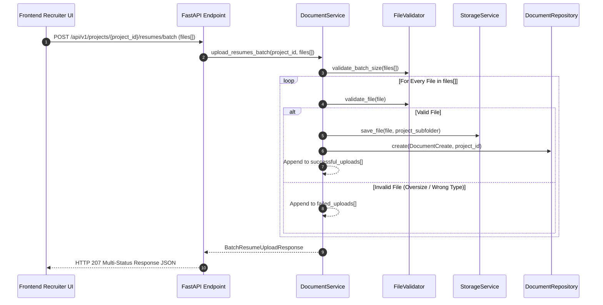

# Architecture Specification: Recruiter Upload Workflow Redesign

**Project**: `ai-resume-screener`  
**Subsystem**: Project-Scoped Batch Upload Workflow Redesign  
**Target Stack**: Python 3.12, FastAPI, SQLAlchemy 2.0 (Async), PostgreSQL, Pydantic v2  
**Role**: Principal Software Architect  
**Status**: Approved Technical Specification for Codex Implementation  

---

## Executive Overview

This specification redesigns the document upload workflow to reflect real-world recruiter hiring campaign workflows:

```text
[1. Create Project Campaign] ──► [2. Upload ONE Job Description] ──► [3. Upload MULTIPLE Resumes Batch]
```

### Core Business Workflow
1. **Recruiter creates a Hiring Campaign Project** (e.g., "Senior Python Engineer Q3").
2. **Recruiter attaches ONE Job Description** document for the position.
3. **Recruiter uploads a BATCH of Candidate Resumes** (multiple files in a single drag-and-drop upload request).
4. All uploaded documents are strictly scoped to the `project_id`.
5. Existing Stage 1 (Ingestion) and Stage 2 (Parsing) architecture, models, and validation logic are reused with minimal, backward-compatible updates.

---

## 1. Database Schema & Migration Changes

Add `project_id` foreign key relationship to `documents` table and enforce **at most one active Job Description per project**.

```sql
-- 1. Add project_id foreign key column to documents table
ALTER TABLE documents 
ADD COLUMN IF NOT EXISTS project_id UUID NULL 
REFERENCES projects(id) ON DELETE CASCADE;

-- 2. Index project_id for fast lookup
CREATE INDEX ix_documents_project_id ON documents(project_id);

-- 3. Enforce Unique Active Job Description per Project Constraint
CREATE UNIQUE INDEX uq_project_active_job_description 
ON documents(project_id) 
WHERE document_type = 'JOB_DESCRIPTION' AND deleted_at IS NULL;
```

---

## 2. Updated SQLAlchemy Model (`app/models/document.py`)

Add `project_id` foreign key field and SQLAlchemy ORM relationship:

```text
app/models/document.py
└── DocumentModel
    ├── ... (existing fields: id, document_type, original_filename, stored_filename, etc.)
    ├── project_id: Mapped[Optional[uuid.UUID]] (ForeignKey("projects.id", ondelete="CASCADE"), index=True)
    └── project: Mapped[Optional["ProjectModel"]] (relationship("ProjectModel", back_populates="documents"))
```

In `app/models/project.py`:
```text
app/models/project.py
└── ProjectModel
    ├── ...
    └── documents: Mapped[list["DocumentModel"]] (relationship("DocumentModel", back_populates="project", cascade="all, delete-orphan"))
```

---

## 3. API Contract Redesign & Endpoints

New endpoints are introduced under `/api/v1/projects/{project_id}/`.

### Endpoint Overview

| Method | Route | Description | Request Payload | Response |
| :--- | :--- | :--- | :--- | :--- |
| `POST` | `/api/v1/projects/{project_id}/job-description` | Upload/Replace single Job Description | `file: UploadFile` | `201 Created` (`DocumentRead`) |
| `GET` | `/api/v1/projects/{project_id}/job-description` | Get project Job Description | None | `200 OK` (`DocumentRead`) |
| `POST` | `/api/v1/projects/{project_id}/resumes/batch` | Upload multiple resumes in 1 request | `files: list[UploadFile]` | `207 Multi-Status` (`BatchUploadResponse`) |
| `GET` | `/api/v1/projects/{project_id}/resumes` | List resumes attached to project | Query Params | `200 OK` (`PaginatedResumes`) |

---

### Request & Response Payload Specifications

#### 3.1 `POST /api/v1/projects/{project_id}/job-description`
* **Form Data**: `file: UploadFile` (Required)
* **Behavior**: If the project already has an existing job description, the service automatically soft-deletes the old job description and attaches the new one.
* **Response (HTTP 201 Created)**: Returns standard `DocumentRead` DTO with `project_id`.

#### 3.2 `POST /api/v1/projects/{project_id}/resumes/batch`
* **Form Data**: `files: list[UploadFile]` (Array of files)
* **Response (HTTP 207 Multi-Status / 201 Created)**:
```json
{
  "data": {
    "project_id": "7c9e6679-7425-40de-944b-e07fc1f90ae7",
    "total_received": 3,
    "successful_count": 2,
    "failed_count": 1,
    "successful_uploads": [
      {
        "id": "550e8400-e29b-41d4-a716-446655440000",
        "project_id": "7c9e6679-7425-40de-944b-e07fc1f90ae7",
        "document_type": "RESUME",
        "original_filename": "Alice_Resume.pdf",
        "file_size_bytes": 1048576,
        "mime_type": "application/pdf",
        "status": "UPLOADED",
        "created_at": "2026-08-06T15:00:00Z"
      },
      {
        "id": "661f9511-f30c-52e5-b827-557766551111",
        "project_id": "7c9e6679-7425-40de-944b-e07fc1f90ae7",
        "document_type": "RESUME",
        "original_filename": "Bob_Resume.docx",
        "file_size_bytes": 524288,
        "mime_type": "application/vnd.openxmlformats-officedocument.wordprocessingml.document",
        "status": "UPLOADED",
        "created_at": "2026-08-06T15:00:00Z"
      }
    ],
    "failed_uploads": [
      {
        "original_filename": "unsupported_portfolio.exe",
        "error_code": "INVALID_FILE_TYPE",
        "message": "File extension .exe is not allowed."
      }
    ]
  }
}
```

---

## 4. Pydantic Schemas (`app/schemas/document.py`)

Add project-scoped and batch upload response DTOs:

```python
class FailedUploadItem(BaseModel):
    original_filename: str
    error_code: str
    message: str

class BatchResumeUploadResponse(BaseModel):
    project_id: UUID4
    total_received: int
    successful_count: int
    failed_count: int
    successful_uploads: list[DocumentRead]
    failed_uploads: list[FailedUploadItem]
```

---

## 5. Repository Layer Changes (`app/repositories/document_repository.py`)

Add project-scoped query methods to `DocumentRepository`:

* **`create(document: DocumentCreate, project_id: Optional[UUID4]) -> DocumentModel`**: Persists document associated with `project_id`.
* **`get_job_description_by_project(project_id: UUID4) -> Optional[DocumentModel]`**: Fetches active job description for a project.
* **`list_resumes_by_project(project_id: UUID4, page: int, page_size: int) -> tuple[list[DocumentModel], int]`**: Paginated fetch of resumes scoped to `project_id`.
* **`soft_delete_project_job_description(project_id: UUID4) -> bool`**: Soft-deletes existing job description for a project prior to replacement.

---

## 6. Service Layer Changes (`app/services/document_service.py`)

Add batch handling and replacement logic to `DocumentService`:



---

## 7. Batch Validation & Storage Strategy

### 7.1 Batch Validation Rules (`app/utils/file_validation.py`)
* **Maximum Batch File Count**: Max 50 resume files per batch request (`MAX_BATCH_FILE_COUNT = 50`).
* **Maximum Total Payload Size**: Max 100 MB aggregate payload size per batch upload (`MAX_BATCH_PAYLOAD_SIZE = 100 * 1024 * 1024`).
* **Individual File Validation**: Retains existing 10 MB limit and `.pdf`, `.docx`, `.txt` extension & MIME byte checks.

### 7.2 Storage Layout (`app/services/storage_service.py`)
Organize files under project-specific directories:

```text
storage/
└── uploads/
    └── projects/
        └── {project_id}/
            ├── job_description/
            │   └── 9a1b2c3d-4e5f-6789-0abc-def123456789.pdf
            └── resumes/
                ├── 110e8400-e29b-41d4-a716-446655440000.pdf
                ├── 220e8400-e29b-41d4-a716-446655440001.docx
                └── 330e8400-e29b-41d4-a716-446655440002.pdf
```

---

## 8. Swagger / OpenAPI Configuration

In `app/api/v1/endpoints/documents.py` (or project document router), use FastAPI `UploadFile` array typing:

```python
# FastAPI Swagger endpoint signature design:
@router.post("/projects/{project_id}/resumes/batch", response_model=BatchResumeUploadResponse, status_code=207)
async def upload_resumes_batch(
    project_id: UUID4,
    files: list[UploadFile] = File(..., description="Array of candidate resume files (.pdf, .docx, .txt)")
):
    ...
```

This ensures Swagger UI renders an interactive multi-file file picker widget allowing recruiters to drag and drop multiple resume files simultaneously.

---

## 9. Backward Compatibility & Migration Protocol

1. **Legacy Endpoint Support**: Existing `/api/v1/resumes/upload` and `/api/v1/jobs/upload` routes accept an optional `project_id` query/form parameter.
2. **Schema Migration**: Database migration `add_project_id_to_documents.py` adds nullable `project_id` foreign key without breaking pre-existing uploaded documents.

---

## 10. Testing Strategy

### 10.1 Unit Tests (`tests/unit/`)
* `test_batch_file_validation.py`: Test batch count boundary (>50 files) and total payload size (>100MB) checks.

### 10.2 Integration Tests (`tests/integration/`)
* `test_project_document_repository.py`: Test unique active job description constraint per project and project-scoped resume listing.

### 10.3 E2E Endpoint Tests (`tests/e2e/`)
* `test_batch_resume_upload_api.py`: Test multi-file upload using `httpx.AsyncClient` with `files=[("files", ("resume1.pdf", b"...", "application/pdf")), ("files", ("resume2.docx", b"...", "..."))]`.

---

## 11. File Manifest for Codex Implementation

### Files to Create
```text
backend/app/api/v1/endpoints/project_documents.py
backend/alembic/versions/<timestamp>_add_project_id_to_documents.py
tests/unit/test_batch_file_validation.py
tests/e2e/test_batch_resume_upload_api.py
```

### Files to Modify
```text
backend/app/models/document.py        # Add project_id FK and relationship
backend/app/models/project.py         # Add documents relationship
backend/app/schemas/document.py       # Add BatchResumeUploadResponse & FailedUploadItem
backend/app/repositories/document_repository.py  # Add project-scoped queries
backend/app/services/document_service.py        # Add batch upload & job description replacement logic
backend/app/utils/file_validation.py  # Add batch count and aggregate payload validation
backend/app/api/v1/router.py          # Mount project_documents.py router
```
